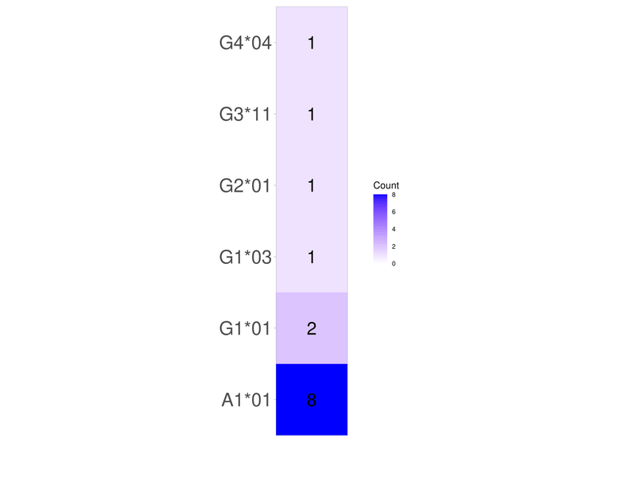

| Usage | Requirement |
| :--- | :--- |
| [](https://www.nextflow.io/) | [](https://github.com/nextflow-io/nextflow) |
| [-green?style=plastic)](https://www.gnu.org/licenses) | [](https://github.com/apptainer/apptainer) |
| | [](https://www.graphviz.org/download/) |

<br><br>
## TABLE OF CONTENTS


   - [AIM](#aim)
   - [WARNING](#warning)
   - [CONTENT](#content)
   - [INPUT](#input)
   - [HOW TO RUN](#how-to-run)
   - [OUTPUT](#output)
   - [VERSIONS](#versions)
   - [LICENCE](#licence)
   - [CITATION](#citation)
   - [CREDITS](#credits)
   - [ACKNOWLEDGEMENTS](#Acknowledgements)
   - [WHAT'S NEW IN](#what's-new-in)

<br><br>
## AIM

- IgBlast annotation of mRNA sequencing of the Immunoglobuline Heavy or Light variable region.
- Incorporation of sequence metadata.
- Repertoire heatmaps, donuts and summary statistics.
- Mutation loads.
- Sequence alignments with FWR/CDR and V/D/J/C annotations.
- Clustering of the annotated sequences into clonal groups (same germline origin).
- Tree visualization of all sequences and the clonal groups.
- Html report and complete outputs in files, as described below.

<br><br>
## WARNINGS

- Right now, only dedicated to the analysis of VDJ repertoires (corresponding to the germlines/imgt/*\<SPECIES\>*/vdj folder of the [IMGT database](https://www.imgt.org/IMGTrepertoire/Proteins/index.php#C).
- To make the repertoires contingency tables and heatmaps, as well as donut plots, the script currently takes the first annotation of the imgt annotation if several are presents in the *v_call*, *j_call* or *c_call* column of the *productive_seq.tsv* file.
- Only the first 100 characters of of fasta files headers are used as sequence name. And any other characters than alphanumeric are replaced by underscores.

<br><br>
## CONTENT

| Files and folder | Description |
| :--- | :--- |
| **main.nf** | File that can be executed using a linux terminal, a MacOS terminal or Windows 10 WSL2. |
| **nextflow.config** | Parameter settings for the *main.nf* file. Users have to open this file, set the desired settings and save these modifications before execution. Of note, this configuration file is systematically saved in the reports folder (see [below](#output)) during each execution, to save the parameter settings. |
| **bin folder** | Contains files required by the *main.nf* file. |
| **Licence.txt** | Licence of the release. |


<br><br>
## INPUT

| Required files |
| :--- |
| A folder (zipped or not) containing nucleotide fasta files, each containing a single sequence.<br>Use table2fasta.R ([https://github.com/gael-millot/table2fasta](https://github.com/gael-millot/table2fasta)) if sequences are in a .table file.<br>In each fasta file, the sequence can be split into several lines (\n and or \r separated). In addition, spaces and tabs can be present in the header (they will be replaced by an underscore). |
| A metadata file (optional) for adding informations in the results. |

<br>

The dataset used in the *nextflow.config* file, as an example, is available at https://zenodo.org/records/17883625/files/human_IGH.zip.

<br>

The metadata file used in the *nextflow.config* file, as an example, is available at https://zenodo.org/records/17883625/files/human_IGH_metadata.tsv.

<br>

Use this code to split a multi sequence fasta file into fasta files made of a single sequence:

```
FASTA_FILE="./test.fasta" # add path and name of the fasta file here
awk -v slice_size=1 -v prefix="cut" '$1 ~ /^>/{nbSeq++; currSlice=int((nbSeq-1)/slice_size)+1; myOutFile=prefix"_"currSlice".fasta"}{print $0 > myOutFile}' ${FASTA_FILE}
```

<br><br>
## HOW TO RUN

### 1. Prerequisite

Installation of:<br>
[nextflow DSL2](file:///C:/Users/gmillot/Documents/Git_projects/protocols/docs/Protocol%20152-rev0%20DSL2.htm#_Toc208504071). Please, use the version indicated above.<br>
[Graphviz](https://www.graphviz.org/download/), `sudo apt install graphviz` for Linux ubuntu.<br>
[Apptainer](https://gael-millot.github.io/protocols/docs/Protocol%20135-rev0%20APPTAINER.html#_Toc160091693).<br>
<br>

Optional installation (to avoid reccurent message) of:<br>
[Gocryptfs](https://github.com/rfjakob/gocryptfs), `sudo apt install gocryptfs` for Linux ubuntu.<br> 

Itol key:<br>
If you need sequence phylogenic trees in the output, you can freely register at https://itol.embl.de/itol_account.cgi to get your own itol key. Once registered, go to https://itol.embl.de/userInfo.cgi and click on the Toggle API access button. Then, add the key in the `phylo_tree_itolkey` parameter of the *nextflow.config* file, and set the `phylo_tree_itol_subscription` parameter to `TRUE`. If you experience problem with registration, set the `phylo_tree_itol_subscription` parameter to `FALSE`. The html output file explains how to see the trees without ITOL key.

<br>

### 2. Local running (personal computer)

#### 2.1. *main.nf* file in the personal computer

- Mount a server if required:

<pre>
DRIVE="Z" # change the letter to fit the correct drive
sudo mkdir /mnt/share
sudo mount -t drvfs $DRIVE: /mnt/share
</pre>

Warning: if no mounting, it is possible that nextflow does nothing, or displays a message like:
<pre>
Launching `main.nf` [loving_morse] - revision: d5aabe528b
/mnt/share/Users
</pre>

- Run the following command from where the *main.nf* and *nextflow.config* files are (example: \\wsl$\Ubuntu-20.04\home\gael):

<pre>
nextflow run main.nf -c nextflow.config # or nextflow run main.nf
</pre>

with -c to specify the name of the config file used.

<br><br>
#### 2.2. *main.nf* file in a public github / gitlab repository

Run the following command from where you want the results:

<pre>
nextflow run -hub pasteur gmillot/repertoire_profiler -r v1.0.0
</pre>

<br><br>

### 3. Distant running (example with the Pasteur cluster)

#### 3.1. Pre-execution

Go into the directory where the main.nf and nextflow.config files are.
Copy-paste this code:

<pre>
EXEC_PATH=$(pwd) # where the bin folder of 19583_loot is located (by default, the same path as for the main.nf file)
export CONF_BEFORE=/opt/gensoft/exe # on maestro

export JAVA_CONF=java/13.0.2
export JAVA_CONF_AFTER=bin/java # on maestro
export APP_CONF=apptainer/1.3.5
export APP_CONF_AFTER=bin/apptainer # on maestro
export GIT_CONF=git/2.39.1
export GIT_CONF_AFTER=bin/git # on maestro
export GRAPHVIZ_CONF=graphviz/2.42.3
export GRAPHVIZ_CONF_AFTER=bin/graphviz # on maestro
export GRAALVM_CONF=graalvm/ce-java17-22.3.1 # required for nextflow
export GRAALVM_CONF_AFTER=bin/graalvm # on maestro
export NEXTFLOW_CONF=nextflow/24.10.3
export NEXTFLOW_CONF_AFTER=bin/nextflow # on maestro

MODULES="${CONF_BEFORE}/${JAVA_CONF}/${JAVA_CONF_AFTER},${CONF_BEFORE}/${APP_CONF}/${APP_CONF_AFTER},${CONF_BEFORE}/${GIT_CONF}/${GIT_CONF_AFTER},${CONF_BEFORE}/${GRAPHVIZ_CONF}/${GRAPHVIZ_CONF_AFTER},${CONF_BEFORE}/${GRAALVM_CONF}/${GRAALVM_CONF_AFTER},${CONF_BEFORE}/${NEXTFLOW_CONF}/${NEXTFLOW_CONF_AFTER}"
cd ${EXEC_PATH}
chmod -R 755 ${EXEC_PATH}/bin/*.* # nextflow needs x authorization for all files and subfolder files
module load ${JAVA_CONF} ${APP_CONF} ${GIT_CONF} ${GRAPHVIZ_CONF} ${GRAALVM_CONF}
module load ${NEXTFLOW_CONF}
</pre>

<br><br>

#### 3.2. *main.nf* file in a cluster folder

Modify the second line of the code below, and run from where the *main.nf* and *nextflow.config* files are (which has been set thanks to the EXEC_PATH variable above):

<pre>
HOME_INI=$HOME
HOME="${HELIXHOME}/repertoire_profiler/" # $HOME changed to allow the creation of .nextflow into /$HELIXHOME/repertoire_profiler/, for instance. See NFX_HOME in the nextflow software script
nextflow run main.nf -c nextflow.config # or nextflow run main.nf -c nextflow.config --modules ${MODULES} in order to have all the used module versions recorded into the report file 
HOME=$HOME_INI
</pre>

<br><br>

#### 3.3. *main.nf* file in the public gitlab repository

Modify the first and third lines of the code below, and run (results will be where the EXEC_PATH variable has been set above):

<pre>
VERSION="v1.0"
HOME_INI=$HOME
HOME="${HELIXHOME}/repertoire_profiler/" # $HOME changed to allow the creation of .nextflow into /$HELIXHOME/repertoire_profiler/, for instance. See NFX_HOME in the nextflow software script
nextflow run -hub pasteur gmillot/repertoire_profiler -r $VERSION -c $HOME/nextflow.config
HOME=$HOME_INI
</pre>

<br><br>
### 4. Error messages and solutions

#### Message 1
```
Unknown error accessing project `gmillot/repertoire_profiler` -- Repository may be corrupted: /pasteur/sonic/homes/gmillot/.nextflow/assets/gmillot/repertoire_profiler
```

Purge using:
<pre>
rm -rf /pasteur/sonic/homes/gmillot/.nextflow/assets/gmillot*
</pre>

#### Message 2
```
WARN: Cannot read project manifest -- Cause: Remote resource not found: https://gitlab.pasteur.fr/api/v4/projects/gmillot%2Frepertoire_profiler
```

Contact Gael Millot (distant repository is not public).

#### Message 3

```
permission denied
```

Use chmod to change the user rights. Example linked to files in the bin folder: 
```
chmod 755 bin/*.*
```

#### Message 4

```
ERROR ~ Error executing process > 'print_report (1)'

Caused by:
  Process `print_report (1)` terminated with an error exit status (1)

...

Command error:
  Quitting from lines 280-301 (report_file.rmd)
  Error in if (file.info(file_path)$size == 0) { :
    missing value where TRUE/FALSE needed
  Calls: <Anonymous> ... eval_with_user_handlers -> eval -> eval -> read_tsv_with_dummy
  Execution halted
```

If obtained using `nextflow run main.nf -resume`, then rerun the same command once. Sometimes, nextflow shows difficulties to build the report.html file with `-resume`. If the problem persists, try `nextflow run main.nf`. If the problem still occurs, please send an issue [here](https://github.com/gael-millot/repertoire_profiler/issues).

#### Message 5

```
ERROR ~ Error executing process > 'ITOL (2)'

Caused by:
  Process `ITOL (2)` terminated with an error exit status (1)
  
INFO:    underlay of /etc/localtime required more than 50 (83) bind mounts
```

Register at Itol as explained in the [Prerequisite](#1-prerequisite) section above, or set the `phylo_tree_itol_subscription` parameter of the *nextflow.config* file to `FALSE` and rerun.


<br><br>
## OUTPUT

By default, all the results are returned in a *result* folder where the *main.nf* executed file is located (created if does not exist). This can be changed using the `out_path_ini` parameter of the *nextflow.config* file. By default, each execution produces a new folder named *repertoire_profiler_\<ID\>*, created inside the *result* folder and containing all the outputs of the execution. The name of the folder can be changed using the `result_folder_name` parameter of the *nextflow.config* file. The new name file will be followed by an \<ID\> in all cases.
<br><br>
An example of results obtained with the dataset is present at this address: https://zenodo.org/records/17900455/files/example_of_results.zip.
<br><br>
If the text is cut in the table, reload the page or change the width of the window.
<br><br>
<div style="overflow-x:auto; max-width:100%;">
<table style="width:100%; border-collapse:collapse; overflow-wrap: anywhere;table-layout:fixed; word-break:break-all;">
    <tr>
        <th style="white-space:normal; text-align:left; word-break:break-all; overflow-wrap:anywhere;">
            repertoire_profiler_&lt;UNIQUE_ID&gt; folders and files
        </th>
        <th style="white-space:normal; text-align:left; word-break:break-all; overflow-wrap:anywhere;">
            Description
        </th>
    </tr>
    <tr>
        <th style="white-space:normal; text-align:left; word-break:break-all; overflow-wrap:anywhere;">
            report.html
        </th>
        <td style="white-space:normal; text-align:left; word-break:break-all; overflow-wrap:anywhere;">
            HTML report presenting the main results of the data processing. 
        </td>
    </tr>
    <tr>
        <th style="white-space:normal; text-align:left; word-break:break-all; overflow-wrap:anywhere;">
            reports
        </th>
        <td style="white-space:normal; text-align:left; word-break:break-all; overflow-wrap:anywhere;">
            Folder containing all the reports of the different processes, as well as the <i>nextflow.config</i> file used and the map of the processes execution (<i>nf_dag.png</i> file). 
        </td>
    </tr>
    <tr>
        <th style="white-space:normal; text-align:left; word-break:break-all; overflow-wrap:anywhere;">
            repertoires
        </th>
        <td style="white-space:normal; text-align:left; word-break:break-all; overflow-wrap:anywhere;">
            Folder containing the repertoires, i.e., contingency tables of the V, J and C (constant) allele and gene usage from the <i>productive_seq.tsv</i> file (see below). Warning: the script currently takes the first annotation of the imgt annotation if several are presents in the v_call, j_call and c_call columns of the <i>productive_seq.tsv</i> file. (e.g., v_call with IGKV1-39*01,IGKV1D-39*01), so that contingencies are identical to those from the donut frequencies, that use germline_v_call and germline_j_call columns (allele reassignment by the <code>CreateGermlines.py</code> tool of immcantation) 
        </td>
    </tr>
    <tr>
        <th style="white-space:normal; text-align:left; word-break:break-all; overflow-wrap:anywhere;">
            figures
        </th>
        <td style="white-space:normal; text-align:left; word-break:break-all; overflow-wrap:anywhere;">
            Folder containing:<ul style="padding-left:1.2em; margin:0;"><li><b>png</b>: folder containing the graphs in png format. </li><li><b>svg</b>: folder containing the graphs in svg vectorial format.</ul> 
        </td>
    </tr>
    <tr>
        <th style="white-space:normal; text-align:left; word-break:break-all; overflow-wrap:anywhere;">
            RData
        </th>
        <td style="white-space:normal; text-align:left; word-break:break-all; overflow-wrap:anywhere;">
            Folder containing, for each clonal group, objects that can be used in R to further analyze or plot the data:
            <br><ul style="padding-left:1.2em; margin:0;"><li>db: tibble data frame resulting from the import by the <code>alakazam::readChangeoDb()</code> function.
            <br></li><li>clones: db in the airClone format.
            <br></li><li>trees: output of the <code>dowser::getTrees()</code> function using the clones object as input (igphylm tree).
            </ul><br>Also contains the all_trees.RData file that combine the trees R objects of the different files in a single trees object. 
        </td>
    </tr>
    <tr>
        <th style="white-space:normal; text-align:left; word-break:break-all; overflow-wrap:anywhere;">
            alignments
        </th>
        <td style="white-space:normal; text-align:left; word-break:break-word;
    max-width:100%; overflow-wrap:anywhere;">
            Folder containing alignment files in amino-acid (aa folder) and nucleotide (nuc folder) sequences. Each aa and nuc folder includes three folders:
            <ul style="padding-left:1.2em; margin:0;word-break:break-word;
    max-width:100%;">
                <li>all: alignments using the .fasta file of all sequences, either in the fasta/for_alignment_nuc or fasta/for_alignment_aa folder (see below).
                </li><li>clonal: alignments using the .fasta files of all the clonal groups, either in the fasta/for_alignment_nuc or fasta/for_alignment_aa folder (see below).
                </li><li>imgt: alignments using directly the <i>sequence_&#8203;alignment_&#8203;with_&#8203;gaps_&#8203;imgt_&#8203;&lt;nuc OR aa&gt;&#8203;.fasta</i> file present in this folder, as sequences are already aligned. Coordinates in <i>*_biojs.gff</i> and <i>*_jalview.gff</i> files are those in the <i>*_alignment_with_gaps_start</i> / <i>*_alignment_with_gaps_end</i>, or <i>*_alignment_start</i> / <i>*_alignment_end</i> columns of the <i>productive_seq.tsv</i> file, respectively. Folder absent if the <code>align_seq</code> parameter of the <i>nextflow.config</i> file is other than <code>query|igblast_full|trimmed|sequence_alignment</code>.
                </ul><br>
            Each of the all, clonal and imgt folders containing the following files:
            <ul style="padding-left:1.2em; margin:0;word-break:break-word;
    max-width:100%;">
                <li>*.html: visualization of the alignments. For all sequences, the name is <i>&lt;ALIGN_SEQ&gt;&#8203;_aligned_&lt;&#8203;nuc OR aa&gt;&#8203;.html</i>. For clonal groups, each file is named as <i>&lt;ALIGN_SEQ&gt;&#8203;_clone_id_&#8203;&lt;CLONE_ID&gt;&#8203;_&lt;V_GENE&gt;&#8203;_&lt;J_GENE&gt;&#8203;_aligned_&lt;&#8203;nuc OR aa&gt;&#8203;.html</i>. For imgt, the name is <i>sequence_&#8203;alignment_&#8203;with_&#8203;gaps_&#8203;imgt_&lt;&#8203;nuc OR aa&gt;&#8203;.html</i>.
                </li><li>*.fasta: aligned sequences. Each file is named as the corresponding <i>.html</i> file. Warning: in aa files, all the * (stop) are replaced by X. Thus, X means either "unknown" or "stop" specifically in these files. In the imgt folder, nucleotides sequences come from the <i>sequence_alignment_with_gaps</i> and <i>sequence_alignment_with_gaps_aa</i> columns of the productive_seq.tsv file. Warning: aa sequences can be aberrant if the nucleotide sequence is not in codon phase from the 5' part beginning (X aa should be present in the sequence, as well as aa sequence unproperly aligned to the others).
                </li><li>*.gff: gff files used to add domain features in alignment visualization, named as the <i>.html</i> file. Files ending by <i>biojs.gff</i> are for the <i>.html</i> file. Files ending by <i>jalview.gff</i> are for <a href="https://www.jalview.org/">jalview</a>. Coordinates indicated in these files are from:
                            <ul style="padding-left:1.2em; margin:0;"><li>all: <i>&lt;vdjc&gt;&#8203;_sequence&#8203;_start/&#8203;end</i> and  <i>&lt;fwr|cdr&gt;&#8203;_start/&#8203;end</i> columns of the <i>productive_seq.tsv</i> files if <code>align_seq</code> parameter of the <i>nextflow.config</i> file is <code>igblast_full|query</code>, and from the <i>&lt;vdjc|&#8203;fwr|&#8203;cdr&gt;&#8203;_sequence_&#8203;start/&#8203;end</i> columns of the <i>productive_seq.tsv</i> files otherwise.
                            </li><li>clonal: <i>&lt;vdjc|&#8203;fwr|&#8203;cdr&gt;&#8203;_clonal_&#8203;germline_*&#8203;_start/&#8203;end</i> columns of the <i>clone_assigned_seq.tsv</i> file.
                            </li><li>imgt: <i>&lt;vdjc|&#8203;fwr|&#8203;cdr&gt;&#8203;_*_&#8203;alignment_&#8203;with_&#8203;gaps_&#8203;start/&#8203;end</i> columns of the <i>productive_seq.tsv</i> file.
                </ul>Warning: for <i>biojs.gff</i>, coordinates do not match necessarily with the corresponding columns of .tsv files indicated above, since they are adjusted to the number of hyphens and dots inserted in the aligned sequences. However, they match in the <i>jalview.gff</i> file, in accordance with requirement of this visualization tool.
                <br>Warning: coordinates provided for the aa sequences can be approximated if the coordinates of the nuc sequences in the .tsv files are not multiple of 3. They can even be aberrant if the nucleotide sequence is not in codon phase from the 5' part beginning (X aa should be present in the sequence, as well as aa sequence unproperly aligned to the others). See the <i>GffAa.log</i> in the <i>report</i> folder.
                <br>Coordinates are returned in the .gff files, except if the <code>align_seq</code> parameter of the <i>nextflow.config</i> file is <code>fwr1|fwr2|fwr3|fwr4|cdr1|cdr2|cdr3|junction</code> (<i>vdjc_*.gff</i> and <i>fwr_cdr_*.gff</i> files are empty).
                <br>Warning: coordinates might not be correct in the masked region when the <code>clone_germline_kind</code> parameter of the <i>nextflow.config</i> file is set to "dmask".
                </ul><br>
            Alignments are perfomed using <a href="http://cao.labshare.cn/abalign/">Abalign</a> (see the <code>align_abalign_options</code> parameter in the <i>nextflow.config</i> file), or <a href="https://mafft.cbrc.jp/alignment/server/index.html">Mafft</a> (see the <code>align_mafft_all_options</code> and <code>align_mafft_clonal_options</code> parameters in the <i>nextflow.config</i> file) depending on the <code>align_soft</code> parameter of the <i>nextflow.config</i> file, but systematically by Mafft if the <code>align_seq</code> parameter of the <i>nextflow.config</i> file is <code>query</code>, <code>igblast_full</code>, <code>trimmed</code>, <code>c_sequence_alignment</code> or <code>c_germline_alignment</code>.<br><br>
            Warning: html, fasta and gff files can be absent for clonal groups if none have at least the number of sequences indicated in the <code>align_clone_nb</code> parameter in the <i>nextflow.config</i> file.<br><br>
            Warning: Abalign can skip some sequences if too short. Thus, the number of aligned sequences can be lower than in the input files in <i>fasta/for_alignment_nuc</i> and <i>fasta/for_alignment_aa</i> (see below).
    </tr>
    <tr>
        <th style="white-space:normal; text-align:left; word-break:break-all; overflow-wrap:anywhere;">
            phylo
        </th>
        <td style="white-space:normal; text-align:left; word-break:break-all; overflow-wrap:anywhere;">
            Folder containing phylogenic tree files in amino-acid (aa folder) and nucleotide (nuc folder) sequences of each .fasta aligment file present in the <i>alignments</i> folder. Trees are obtained using <code>iqtree -m phylo_tree_model_file+GTR+I+R6</code> for nucleotide sequences and <code>iqtree -m phylo_tree_model_file+I+R6</code> for aa sequences, with <code>phylo_tree_model_file</code> a parameter of the <i>nextflow.config</i> file. By default, this parameter is a <a href="https://doi.org/10.1093/molbev/msu340">AB model</a> file dedicated to antibodies.
            <ul style="padding-left:1.2em; margin:0;"><li>*fasta.treefile: phylogenetic tree in Newick format for each sequence group in the phylo file (not constructed for groups with fewer than 4 sequences).</li><li>*fasta_itol_url.txt (if the <code>phylo_tree_itol_subscription</code> parameter of the <i>newtflow.config</i> file is <code>TRUE</code>): URL of the phylogenetic tree in iTOL.</li></ul>
        </td>
    </tr>
    <tr>
        <th style="white-space:normal; text-align:left; word-break:break-all; overflow-wrap:anywhere;">
            fasta
        </th>
        <td style="white-space:normal; text-align:left; word-break:break-all; overflow-wrap:anywhere;">
            Folder containing all fasta files:
            <ul style="padding-left:1.2em; margin:0;word-break:break-all; overflow-wrap:anywhere;"><li><b>for_alignment_nuc</b>: folder containing 1) a fasta file with all nucleotide sequences, and 2) one fasta file with nucleotide sequences per clonal group (i.e., sequences with the same value in the <i>clone_id</i> column of the <i>clone_assigned_seq.tsv</i> file). The kind of sequences depends on what has been selected in the <code>align_seq</code> parameter of the <i>nextflow.config</i> file.<br>Warning: fasta files can be absent for clonal groups if none have at least the number of sequences indicated in the <code>align_clone_nb</code> parameter in the <i>nextflow.config</i> file.<br>Each clonal file is named as <i>&lt;ALIGN_SEQ&gt;&#8203;_clone_id_&lt;&#8203;CLONE_ID&gt;_&lt;&#8203;V_GENE&gt;_&lt;&#8203;J_GENE&gt;&#8203;.fasta</i>.<br>The <i>clonal_germline_sequence_no_gaps</i> column of <i>clone_assigned_seq.tsv</i> is also added in clonal group fasta files with the following rule: 1) if all the <i>clonal_germline_sequence_no_gaps</i> sequences are not identical in the clonal group, the most frequent one is used and 2) if there is more than one most frequent germline sequence, then the first one is taken. See the <i>Tsv2fasta.log</i> file in the <i>report</i> folder. Warning: the clonal germline sequence is always the variable region only (thus, can be shorter compared to the other sequences).<br>Sequences are made of ATGCN.
            </li><li><b>for_alignment_aa</b>: idem to <i>for_alignment_nuc</i> but using the corresponding aa columns of the <i>clone_assigned_seq.tsv</i> file. Each file is named as <i>&lt;ALIGN_SEQ&gt;&#8203;_aa_clone_id_&lt;&#8203;CLONE_ID&gt;_&lt;&#8203;V_GENE&gt;_&lt;&#8203;J_GENE&gt;&#8203;.fasta</i>. Germline sequence addition follows the same rules as in <i>for_alignment_nuc</i>, but using the corresponding aa columns (<code>align_seq</code> parameter and <i>clonal_germline_sequence_aa</i>). Of note, even if the name of the clonal germline sequence is the same in both the nuc and aa alignment fasta file (for instance, trimmed&#8203;_sequence&#8203;_clone&#8203;_id&#8203;_10&#8203;_IGHV4-34&#8203;_IGHJ6), sequences comes from 2 different columns (for instance, <i>trimmed_sequence</i> for nuc and <i>trimmed_sequence_aa</i> for aa). Sequences are made of single letter aa with X added. Warning: all the * (stop) are replaced by X to generate the <i>.fasta</i> files. Otherwise, the aligners (mafft and abalign) remove the stars, which shifts the correspondance between aa and nuc sequences.
            </li><li><b>productive_nuc</b>: folder containing fasta files of the nucleotidic sequences in the <i>productive_seq.tsv</i> file.
            <ul style="padding-left:1.2em; margin:0;"><li><b>query</b>: folder of the sequences from the <i>sequence</i> column. Sequences are made of ATGCN.
            </li><li><b>removed</b>: folder of the sequences from the <i>removed_sequence</i> column. Sequences are made of ATGCN.
            </li><li><b>trimmed</b>: folder of the sequences from the <i>trimmed_sequence</i> column. Sequences are made of ATGCN. Warning: empty fasta means that no 5' trimming was performed by <code>seqkit subseq</code> because 5' parts of sequences in the <i>sequence</i> and <i>sequence_alignment</i> columns are identical (<i>is_sequence_trimmed</i> column is FALSE).
            </li><li><b>align</b>: folder of the sequences from the <i>sequence_alignment</i> column. Sequences are made of ATGCN-.
            </li><li><b>align_with_gaps</b>: folder of the sequences from the <i>sequence_alignment_with_gaps</i> column. Sequences are made of ATGCN.-.
            </li></ul></li><li><b>productive_aa</b>: folder containing fasta files of the translated sequences in the <i>productive_seq.tsv</i> file.
            <ul style="padding-left:1.2em; margin:0;"><li><b>query</b>: folder of the sequences from the <i>query_sequence_aa</i> column. Sequences are made of single letter aa with X (unknown) and * (stop) added.
            </li><li><b>igblast</b>: folder of the sequences from the <i>sequence_aa</i> column. Sequences are made of single letter aa with X (unknown) and * (stop) added.
            </li><li><b>trimmed</b>: folder of the sequences from the <i>trimmed_sequence_aa</i> column. Sequences are made of single letter aa with X (unknown) and * (stop) added. Warning: empty fasta means that no 5' trimming was performed by <code>seqkit subseq</code> because 5' parts of sequences in the <i>sequence</i> and <i>sequence_alignment</i> columns are identical (<i>is_sequence_trimmed</i> column is FALSE).
            </li><li><b>align</b>: folder of the sequences from the <i>sequence_alignment_aa</i> column. Sequences are made of single letter aa with with X (unknown), * (stop) and - added.</li></ul>
            <br><b>IMPORTANT NOTE ABOUT CLONAL GROUPS</b> :<br>If the <code>clone_strategy</code> parameter in <i>nextflow.config</i> is set to "set", a single clonal group may contain different gene assignments. In such cases, the germline sequence included in the aligned FASTA file is selected as the most frequent germline sequence within the group.<br>If multiple germline sequences are equally frequent, the one associated with the first sequence (after sorting the group by sequence ID) is used. A warning is written to the log file whenever multiple germline sequences are detected in a group. 
        </td>
    </tr>
    <tr>
        <th style="white-space:normal; text-align:left; word-break:break-all; overflow-wrap:anywhere;">
            pdf
        </th>
        <td style="white-space:normal; text-align:left; word-break:break-all; overflow-wrap:anywhere;">
            Folder containing all the  <b>pdf files</b> described below : 
        </td>
    </tr>
    <tr>
        <th style="white-space:normal; text-align:left; word-break:break-all; overflow-wrap:anywhere;">
            - seq_distance.pdf
        </th>
        <td style="white-space:normal; text-align:left; word-break:break-all; overflow-wrap:anywhere;">
            Distribution of the distances between the two nearest sequences (see the <i>nearest_distance</i> column in the <i>productive_seq.tsv</i> file). 
        </td>
    </tr>
    <tr>
        <th style="white-space:normal; text-align:left; word-break:break-all; overflow-wrap:anywhere;">
            - donuts.pdf
        </th>
        <td style="white-space:normal; text-align:left; word-break:break-all; overflow-wrap:anywhere;">
            Donut plots showing the frequency of sequences among:<br><ul style="padding-left:1.2em; margin:0;"><li><b>all</b>: all the productive sequences (<i>productive_seq.tsv</i> output file).
            <br></li><li><b>annotated</b>: as the "all" donut but using all the productive sequences that have been annotated using the <code>meta_name_replacement</code> parameter of the <i>nextflow.config</i> file if not "NULL".
            <br></li><li><b>trees</b>: all the sequences used for germline trees (<i>germ_tree_seq.tsv</i> output file).</li>
            </ul>
            <br>Warning: the script currently takes the first annotation of the imgt annotation if several are presents in the v_call, j_call or c_call columns of the <i>productive_seq.tsv</i> and <i>germ_tree_seq.tsv</i> files.
        </td>
    </tr>
    <tr>
        <th style="white-space:normal; text-align:left; word-break:break-all; overflow-wrap:anywhere;">
            - *_repertoire.pdf
        </th>
        <td style="white-space:normal; text-align:left; word-break:break-all; overflow-wrap:anywhere;">
            heatmap of the files from the <i>repertoires</i> folder (see above), showing the frequency of 1) alleles or 2) genes used among all the all productive sequences ("all"), non empty cells ("non-zero") and "annotated" sequences (if metadata are provided). Non-zero means that unused alleles are removed from the heatmap (empty row or column). Warning: to build the repertoire contingencies, the script currently takes the first annotation of the imgt annotation if several are presents in the v_call, j_call or c_call columns of the <i>productive_seq.tsv</i> file. 
        </td>
    </tr>
    <tr>
        <th style="white-space:normal; text-align:left; word-break:break-all; overflow-wrap:anywhere;">
            tsv
        </th>
        <td style="white-space:normal; text-align:left; word-break:break-all; overflow-wrap:anywhere;">
            Folder containing all the  <b>tsv files</b> described below : 
        </td>
    </tr>
    <tr>
        <th style="white-space:normal; text-align:left; word-break:break-all; overflow-wrap:anywhere;">
            - igblast_seq.tsv
        </th>
        <td style="white-space:normal; text-align:left; word-break:break-all; overflow-wrap:anywhere;">
            sequences annotated by igblast (more precisely by <code>AssignGenes.py igblast --format airr</code>). If empty, generate a subsequent nextflow failure. See <i>productive_seq.tsv</i> below for the description of the columns. Of note, the number of lines in <i>failed_igblast_seq.tsv</i> and <i>igblast_seq.tsv</i> is equal to the number of submitted .fasta files (header excluded). 
        </td>
    </tr>
    <tr>
        <th style="white-space:normal; text-align:left; word-break:break-all; overflow-wrap:anywhere;">
            - failed_igblast_seq.tsv
        </th>
        <td style="white-space:normal; text-align:left; word-break:break-all; overflow-wrap:anywhere;">
            sequences that failed to be annotated by igblast (header only if all the sequences are annotated). 
        </td>
    </tr>
    <tr>
        <th style="white-space:normal; text-align:left; word-break:break-all; overflow-wrap:anywhere;">
            - productive_seq.tsv
        </th>
        <td style="white-space:normal; text-align:left; word-break:break-all; overflow-wrap:anywhere;">
            Productive sequences. Productive <a href="https://docs.airr-community.org/en/stable/datarep/rearrangements.html#productive">means</a>: (1) coding region has an open reading frame, (2) no defect in the start codon, splicing sites or regulatory elements, (3) no internal stop codons, (4) an in-frame <a href="https://docs.airr-community.org/en/stable/datarep/rearrangements.html#junction-versus-cdr3">junction</a> region. See the <i>failed_productive_seq.tsv</i> file for sequences that failed to be productive.<br><br><b>Names in bold</b> are columns that have been added or modified, compared to the output of <code>AssignGenes.py igblast --format airr</code>. Thus, coordinates (columns ending by "_start" and "_end") are those returned by <code>AssignGenes.py igblast --format airr</code>, otherwise specified.<br><br><a href="https://docs.airr-community.org/en/stable/datarep/rearrangements.html#coordinate-numbering">Coordinates</a> are 1-based numbering with closed intervals. This means that 1) the very first position in sequence is numbered 1 (not 0) and 2) both the start and the end positions are included in the range. Warning, position 1 is the first nucleotide or aa detected in a specific region (v for instance). It does not mean that this region is complete. It can be truncated on the left part. NA position means that the specific region could not be detected.<br><br>Warning: the germline sequences in this file are different from those added in <i>clone_assigned_seq.tsv</i> (see below). Here, they recontruct the putative germline sequences using the initial single sequence (one specific germline sequence per line), while in the clonal germline sequence of <i>clone_assigned_seq.tsv</i>, they uses all the sequences from the same clone (same germline sequence per group of lines). Thus, sequences with the same clone_ID can have different sequences in the <i>germline_aligment</i> column.<br><br>Column description (from <a href="https://docs.airr-community.org/en/stable/datarep/rearrangements.html#fields">here</a> for the names not in bold, with fields not kept <a href="./bin/fields_not_kept.txt">here</a>):
            <br><ul style="padding-left:1.2em; margin:0;"><li><b>sequence_id</b>: equivalent to <i>initial_sequence_id</i> column but modified with new names according to the <code>meta_name_replacement</code> parameter of the <i>nextflow.config</i> file.
            <br></li><li><b>initial_sequence_id</b>: optional. Only present if the <i>meta_path</i> and <code>meta_name_replacement</code> parameters of the <i>nextflow.config</i> file are non NULL. Originaly the <i>sequence_id</i> column of the <code>AssignGenes.py igblast --format airr</code> output. Unique query sequence identifier for the Rearrangement. Most often this will be the input sequence header or a substring thereof, but may also be a custom identifier defined by the tool in cases where query sequences have been combined in some fashion prior to alignment. When downloaded from an AIRR Data Commons repository, this will usually be a universally unique record locator for linking with other objects in the AIRR Data Model.
            <br></li><li>rev_comp: True if the alignment is on the opposite strand (reverse complemented) with respect to the query sequence. If True then all output data, such as alignment coordinates and sequences, are based on the reverse complement of 'sequence'.
            <br></li><li>stop_codon: True if the aligned sequence contains a stop codon.
            <br></li><li>vj_in_frame: True if the V and J gene alignments are in-frame.
            <br></li><li>v_frameshift: True if the V gene in the query nucleotide sequence contains a translational <a href="https://docs.airr-community.org/en/stable/datarep/rearrangements.html#frameshifts">frameshift</a> relative to the frame of the V gene reference sequence.
            <br></li><li>complete_vdj: True if the sequence alignment spans the entire V(D)J region. Meaning, sequence_alignment includes both the first V gene codon that encodes the mature polypeptide chain (i.e., after the leader sequence) and the last complete codon of the J gene (i.e., before the J-C splice site). This does not require an absence of deletions within the internal FWR and CDR regions of the alignment.
            <br></li><li>d_frame: Numerical reading frame (1, 2, 3) of the D gene in the query nucleotide sequence, where frame 1 is relative to the first codon of D gene reference sequence.
            <br></li><li>productive: True if the V(D)J sequence is predicted to be productive.
            <br></li><li>v_call: V gene (i.e., cassette) with allele after the star (e.g., IGHV4-59*01 if using IMGT/GENE-DB). Sometimes, Igblast cannot distinguished between several reference sequences (cassette or allele), and are all provided, comma separated (e.g., IGHJ5*01,IGHJ5*02).
            <br></li><li>d_call: as in the <i>v_call</i> column but for D gene with allele.
            <br></li><li>j_call: as in the <i>v_call</i> column but for J gene with allele.
            <br></li><li>c_call: as in the <i>v_call</i> column but for Constant region gene with allele.
            <br></li><li>locus: Gene locus (chain type). Note that this field uses a controlled vocabulary that is meant to provide a generic classification of the locus, not necessarily the correct designation according to a specific nomenclature.
            <br></li><li>sequence: the query (input) nucleotide sequence. Usually, this is the unmodified input sequence, which may be reverse complemented if necessary. In some cases, this field may contain consensus sequences or other types of collapsed input sequences if these steps are performed prior to alignment.
            <br></li><li>sequence_alignment: Aligned portion of query sequence (i.e., <i>sequence</i> column). Typically, this will include  <b>only the V(D)J region</b>, but that is not a requirement, explaining why this sequence lacks the 3' part of the sequence indicated in the <i>sequence</i> column. Warning, it seems that <code>AssignGenes.py igblast --format airr</code> (currently used in this pipeline) does not introduce the IMGT-gaps spacers (dots) as with <code>AssignGenes.py igblast --format blast</code> (previously used in this pipeline). See the <i>sequence_alignment_with_gaps</i> column to have the IMGT-gaps spacers (but see also the <i>align_seq_identical</i> column to check that both sequences are identical, gaps excluded). Of note, <i>v_sequence_alignment</i>, <i>d_sequence_alignment</i>, <i>j_sequence_alignment</i> and <i>c_sequence_alignment</i> sequence assembly is not always equivalent to <i>sequence_alignment</i>, due to extra nucleotides between v-d, d-j and j-c, and potential overlap between j-c. Sequences are made of ATGCN- (no dot spacers as indicated above. If dots are present in the sequence, please report an issue <a href="https://gitlab.pasteur.fr/gmillot/repertoire_profiler/-/issues">here</a>).
            <br></li><li>germline_alignment: Assembled, aligned, full-length inferred germline sequence spanning the same region as the sequence_alignment field (typically the V(D)J region), but without the dot spacers as explained in the <i>sequence_alignment</i> column above. Thus, If well understood, this sequence is built from V, D, J reference sequences from the IMGT database that match the sequence in sequence_alignment. The aligned parts of these V, D, J references are stitched together, and the <code>N</code> nucleotides in the germline alignment sequence are positions that belong to no templated nucleotides, added during V(D)J recombination by enzymes involved in this process, and not part of the reference. These 'N's only appear in the junction region where DJ recombination and V-DJ recombination happened and are present where VDJ reference cassettes don't match each other.<br>Warning, it seems that <code>AssignGenes.py igblast --format airr</code> (currently used in this pipeline) does not introduce the IMGT-gaps spacers (dots) as with <code>AssignGenes.py igblast --format blast</code> (previously used in this pipeline). See the <i>germline_alignment_with_gaps</i> column to have the IMGT-gaps spacers. Of note, <i>v_germline_alignment</i>, <i>d_germline_alignment</i>, <i>j_germline_alignment</i> and <i>c_germline_alignment</i> sequence assembly is not always equivalent to <i>germline_alignment</i>, due to extra nucleotides between v-d, d-j and j-c, and potential overlap between j-c. Sequences are made of ATGCN- (no dot spacers as indicated above. If dots are present in the sequence, please report an issue <a href="https://gitlab.pasteur.fr/gmillot/repertoire_profiler/-/issues">here</a>).
            <br></li><li>sequence_aa: Translation in aa of the query nucleotide sequence performed by <code>AssignGenes.py igblast --format airr</code>. Warning: trimming is performed so that the translation starts by the aa of the v region (see the <i>aa_identical</i> column description below). Thus, beware with regions coodinates. Sequences are made of single letter aa with X (unknown) and * (stop) added.
            <br></li><li>sequence_alignment_aa: Amino acid translation of the <i>sequence_alignment</i> column.  Warning: see the <i>aa_identical</i> column description. Of note, <i>v_sequence_alignment_aa</i>, <i>d_sequence_alignment_aa</i>, <i>j_sequence_alignment_aa</i> and <i>c_sequence_alignment_aa</i> sequence assembly is not always equivalent to <i>sequence_alignment_aa</i>, due to extra amino acids between v-d, d-j and j-c. Sequences are made of single letter aa with X, * and - added.
            <br></li><li>germline_alignment_aa: Amino acid translation of the <i>germline_alignment</i> column. Warning: see the <i>aa_identical</i> column description. Of note, <i>v_germline_alignment_aa</i>, <i>d_germline_alignment_aa</i>, <i>j_germline_alignment_aa</i> and <i>c_germline_alignment_aa</i> sequence assembly is not always equivalent to <i>germline_alignment_aa</i>, due to extra amino acids between v-d, d-j and j-c. Sequences are made of single letter aa with X, * and - added.
            <br></li><li>v_alignment_start: Start position of the V gene alignment in both the <i>sequence_alignment</i> and <i>germline_alignment</i> fields (1-based closed interval). Thus, coordinates are without IMGT gaps (dots). See the <i>sequence_alignment</i> field above.
            <br></li><li>v_alignment_end: End position of the V gene alignment in both the <i>sequence_alignment</i> and <i>germline_alignment</i> fields (1-based closed interval).
            <br></li><li>d_alignment_start: Start position of the D gene in both the <i>sequence_alignment</i> and <i>germline_alignment</i> fields (1-based closed interval). Warning: D can overlap V.
            <br></li><li>d_alignment_end: End position of the D gene in both the <i>sequence_alignment</i> and <i>germline_alignment</i> fields (1-based closed interval). Warning: D can overlap J.
            <br></li><li>j_alignment_start: Start position of the J gene alignment in both the <i>sequence_alignment</i> and <i>germline_alignment</i> fields (1-based closed interval).
            <br></li><li>j_alignment_end: End position of the J gene alignment in both the <i>sequence_alignment</i> and <i>germline_alignment</i> fields (1-based closed interval).
            <br></li><li>c_alignment_start: Start position of the C gene alignment in both the <i>sequence_alignment</i> and <i>germline_alignment</i> fields (1-based closed interval).
            <br></li><li>c_alignment_end: End position of the C gene alignment in both the <i>sequence_alignment</i> and <i>germline_alignment</i> fields (1-based closed interval).
            <br></li><li>v_sequence_alignment: Aligned portion of query sequence (i.e., <i>sequence</i> column) assigned to the V gene, including any indel corrections or numbering spacers. Sequences are made of ATGC-.
            <br></li><li>v_sequence_alignment_aa: Amino acid translation of the v_sequence_alignment field. Sequences are made of single letter aa with - added.
            <br></li><li>v_germline_alignment: Aligned V gene germline sequence spanning the same region as the v_sequence_alignment field and including the same set of corrections and spacers (if any). Sequences are made of ATGC-.
            <br></li><li>v_germline_alignment_aa: Amino acid translation of the v_germline_alignment field.
            <br></li><li>d_sequence_alignment: Aligned portion of query sequence (i.e., <i>sequence</i> column) assigned to the D gene, including any indel corrections or numbering spacers. Sequences are made of ATGC-.
            <br></li><li>d_sequence_alignment_aa: Amino acid translation of the d_sequence_alignment field.
            <br></li><li>d_germline_alignment: Aligned D gene germline sequence spanning the same region as the d_sequence_alignment field and including the same set of corrections and spacers (if any). Sequences are made of single letter aa with - added.
            <br></li><li>d_germline_alignment_aa: Amino acid translation of the d_germline_alignment field.
            <br></li><li>j_sequence_alignment: Aligned portion of query sequence (i.e., <i>sequence</i> column) assigned to the J gene, including any indel corrections or numbering spacers. Sequences are made of ATGC-.
            <br></li><li>j_sequence_alignment_aa: Amino acid translation of the j_sequence_alignment field.
            <br></li><li>j_germline_alignment: Aligned J gene germline sequence spanning the same region as the j_sequence_alignment field and including the same set of corrections and spacers (if any). Sequences are made of single letter aa with - added.
            <br></li><li>j_germline_alignment_aa: Amino acid translation of the j_germline_alignment field.
            <br></li><li>c_sequence_alignment: Aligned portion of query sequence (i.e., <i>sequence</i> column) assigned to the constant region, including any indel corrections or numbering spacers. Sequences are made of ATGC-.
            <br></li><li>c_sequence_alignment_aa: Amino acid translation of the c_sequence_alignment field. Sequences are made of single letter aa with - added.
            <br></li><li>c_germline_alignment: Aligned constant region germline sequence spanning the same region as the c_sequence_alignment field and including the same set of corrections and spacers (if any).
            <br></li><li>c_germline_alignment_aa: Amino acid translation of the c_germline_aligment field. Sequences are made of single letter aa with - added.
            <br></li><li>fwr1: Nucleotide sequence of the aligned FWR1 region of the query sequence (i.e., FWR1 region of the <i>sequence_alignment</i> field, which is the input sequence with IMGT gaps added). Sequences are made of ATGC.
            <br></li><li>fwr1_aa: Amino acid translation of the fwr1 field. Sequences are made of single letter aa.
            <br></li><li>cdr1: Nucleotide sequence of the aligned CDR1 region of the query sequence (i.e., CDR1 region of the <i>sequence_alignment</i> field, which is the input sequence with IMGT gaps added). Sequences are made of ATGC.
            <br></li><li>cdr1_aa: Amino acid translation of the cdr1 field. Sequences are made of single letter aa.
            <br></li><li>fwr2: Nucleotide sequence of the aligned FWR2 region of the query sequence (i.e., FWR2 region of the <i>sequence_alignment</i> field, which is the input sequence with IMGT gaps added). Sequences are made of ATGC.
            <br></li><li>fwr2_aa: Amino acid translation of the fwr2 field. Sequences are made of single letter aa.
            <br></li><li>cdr2: Nucleotide sequence of the aligned CDR2 region of the query sequence (i.e., CDR2 region of the <i>sequence_alignment</i> field, which is the input sequence with IMGT gaps added). Sequences are made of ATGC.
            <br></li><li>cdr2_aa: Amino acid translation of the cdr2 field. Sequences are made of single letter aa.
            <br></li><li>fwr3: Nucleotide sequence of the aligned FWR3 region of the query sequence (i.e., FWR3 region of the <i>sequence_alignment</i> field, which is the input sequence with IMGT gaps added). Sequences are made of ATGC.
            <br></li><li>fwr3_aa: Amino acid translation of the fwr3 field. Sequences are made of single letter aa.
            <br></li><li>fwr4: Nucleotide sequence of the aligned FWR4 region of the query sequence (i.e., FWR4 region of the <i>sequence_alignment</i> field, which is the input sequence with IMGT gaps added). Sequences are made of ATGC.
            <br></li><li>fwr4_aa: Amino acid translation of the fwr4 field. Sequences are made of single letter aa.
            <br></li><li>cdr3: Nucleotide sequence of the aligned CDR3 region of the query sequence (i.e., CDR3 region of the <i>sequence_alignment</i> field, which is the input sequence with IMGT gaps added). Sequences are made of ATGC.
            <br></li><li>cdr3_aa: Amino acid translation of the cdr3 field. Sequences are made of single letter aa.
            <br></li><li>junction: Junction region nucleotide sequence, where the <a href="https://docs.airr-community.org/en/stable/datarep/rearrangements.html#junction-versus-cdr3">Junction</a> is defined as the CDR3 plus the two flanking conserved codons (including the conserved cysteine and tryptophan/phenylalanine residues, while CDR3 excludes those). Sequences are made of ATGC.
            <br></li><li>junction_length: Number of nucleotides in the junction sequence.
            <br></li><li>junction_aa: Amino acid translation of the junction. Sequences are made of single letter aa.
            <br></li><li>junction_aa_length: Number of amino acids in the junction sequence.
            <br></li><li>v_score: Alignment score for the V gene.
            <br></li><li>d_score: Alignment score for the D gene alignment.
            <br></li><li>j_score: Alignment score for the J gene alignment.
            <br></li><li>c_score: Alignment score for the C gene alignment.
            <br></li><li>v_cigar: CIGAR string for the V gene alignment.
            <br></li><li>d_cigar: CIGAR string for the D gene alignment.
            <br></li><li>j_cigar: CIGAR string for the J gene alignment.
            <br></li><li>c_cigar: CIGAR string for the C gene alignment.
            <br></li><li>v_support: V gene alignment E-value, p-value, likelihood, probability or other similar measure of support for the V gene assignment as defined by the alignment tool.
            <br></li><li>d_support: D gene alignment E-value, p-value, likelihood, probability or other similar measure of support for the D gene as defined by the alignment tool.
            <br></li><li>j_support: J gene alignment E-value, p-value, likelihood, probability or other similar measure of support for the J gene assignment as defined by the alignment tool.
            <br></li><li>c_support: C gene alignment E-value, p-value, likelihood, probability or other similar measure of support for the C gene assignment as defined by the alignment tool.
            <br></li><li>v_identity: Fractional identity for the V gene alignment (proportion).
            <br></li><li>d_identity: Fractional identity for the D gene alignment (proportion).
            <br></li><li>j_identity: Fractional identity for the J gene alignment (proportion).
            <br></li><li>c_identity: Fractional identity for the C gene alignment (proportion).
            <br></li><li>v_sequence_start: Start position of the V gene in the query sequence (i.e., <i>sequence</i> column, 1-based closed interval).
            <br></li><li>v_sequence_end: End position of the V gene in the query sequence (i.e., <i>sequence</i> column, 1-based closed interval).
            <br></li><li>v_germline_start: Alignment start position in the V gene reference sequence (1-based closed interval).
            <br></li><li>v_germline_end: Alignment end position in the V gene reference sequence (1-based closed interval).
            <br></li><li>d_sequence_start: Start position of the D gene in the query sequence (i.e., <i>sequence</i> column, 1-based closed interval).
            <br></li><li>d_sequence_end: End position of the D gene in the query sequence (i.e., <i>sequence</i> column, 1-based closed interval).
            <br></li><li>d_germline_start: Alignment start position in the D gene reference sequence for the D gene (1-based closed interval).
            <br></li><li>d_germline_end: Alignment end position in the D gene reference sequence for the D gene (1-based closed interval).
            <br></li><li>j_sequence_start: Start position of the J gene in the query sequence (i.e., <i>sequence</i> column, 1-based closed interval).
            <br></li><li>j_sequence_end: End position of the J gene in the query sequence (i.e., <i>sequence</i> column, 1-based closed interval).
            <br></li><li>j_germline_start: Alignment start position in the J gene reference sequence (1-based closed interval).
            <br></li><li>j_germline_end: Alignment end position in the J gene reference sequence (1-based closed interval).
            <br></li><li>c_sequence_start: Start position of the C gene in the query sequence (i.e., <i>sequence</i> column, 1-based closed interval).
            <br></li><li>c_sequence_end: End position of the C gene in the query sequence (i.e., <i>sequence</i> column, 1-based closed interval).
            <br></li><li>c_germline_start: Alignment start position in the C gene reference sequence (1-based closed interval).
            <br></li><li>c_germline_end: Alignment end position in the C gene reference sequence (1-based closed interval).
            <br></li><li>fwr1_start: FWR1 start position in the query sequence (i.e., <i>sequence</i> column, 1-based closed interval).
            <br></li><li>fwr1_end: FWR1 end position in the query sequence (i.e., <i>sequence</i> column, 1-based closed interval).
            <br></li><li>cdr1_start: CDR1 start position in the query sequence (i.e., <i>sequence</i> column, 1-based closed interval).
            <br></li><li>cdr1_end: CDR1 end position in the query sequence (i.e., <i>sequence</i> column, 1-based closed interval).
            <br></li><li>fwr2_start: FWR2 start position in the query sequence (i.e., <i>sequence</i> column, 1-based closed interval).
            <br></li><li>fwr2_end: FWR2 end position in the query sequence (i.e., <i>sequence</i> column, 1-based closed interval).
            <br></li><li>cdr2_start: CDR2 start position in the query sequence (i.e., <i>sequence</i> column, 1-based closed interval).
            <br></li><li>cdr2_end: CDR2 end position in the query sequence (i.e., <i>sequence</i> column, 1-based closed interval).
            <br></li><li>fwr3_start: FWR3 start position in the query sequence (i.e., <i>sequence</i> column, 1-based closed interval).
            <br></li><li>fwr3_end: FWR3 end position in the query sequence (i.e., <i>sequence</i> column, 1-based closed interval).
            <br></li><li>fwr4_start: FWR4 start position in the query sequence (i.e., <i>sequence</i> column, 1-based closed interval).
            <br></li><li>fwr4_end: FWR4 end position in the query sequence (i.e., <i>sequence</i> column, 1-based closed interval).
            <br></li><li>cdr3_start: CDR3 start position in the query sequence (i.e., <i>sequence</i> column, 1-based closed interval).
            <br></li><li>cdr3_end: CDR3 end position in the query sequence (i.e., <i>sequence</i> column, 1-based closed interval).
            <br></li><li>np1: Nucleotide sequence of the combined N/P region between the V gene and first D gene alignment or between the V gene and J gene alignments.
            <br></li><li>np1_length: Number of nucleotides between the V gene and first D gene alignments or between the V gene and J gene alignments.
            <br></li><li>np2: Nucleotide sequence of the combined N/P region between either the first D gene and J gene alignments or the first D gene and second D gene alignments.
            <br></li><li>np2_length: Number of nucleotides between either the first D gene and J gene alignments or the first D gene and second D gene alignments.
            <br></li><li><b>sequence_alignment_with_gaps</b>: Aligned portion of query sequence (i.e., <i>sequence</i> column), including any indel corrections or numbering spacers, such as IMGT-gaps (explained <a href="https://www.imgt.org/IMGTScientificChart/Numbering/IMGTIGVLsuperfamily.html">here</a>), in order to fit the <a href="https://www.imgt.org/3Dstructure-DB/doc/IMGTCollier-de-Perles.shtml">collier de perle represention</a>. The IMGT gaps (dots) are included so that equivalent positions — such as framework regions (FR1, FR2, FR3, FR4) and complementarity-determining regions (CDRs) — line up perfectly across all alleles and genes. This standardized alignment allows direct comparison of gene segments from different loci, species, or individuals. Typically, <b>only the V(D)J region</b> is present, explaining why this sequence lacks the 3' part of the sequence indicated in the <i>sequence</i> column. Of note, these sequences correspond to the <i>sequence_alignment</i> column of the .tsv ouptut obtained with <code>AssignGenes.py igblast --format blast</code> and <code>MakeDb.py igblast</code>. Sequences are made of ATGC.-.
            <br></li><li><b>germline_alignment_with_gaps</b>: Assembled, aligned, full-length inferred germline sequence spanning the same region as the sequence_alignment field (typically the V(D)J region) and including the same set of corrections and IMGT-gaps spacers (if any). Thus, If well understood, this sequence is built from V, D, J reference sequences from the IMGT database that match the sequence in sequence_alignment, with potential IMGT-gaps spacers already present in the sequences of the database kept. The aligned parts of these V, D, J references are stitched together, and the <code>N</code> nucleotides in the germline alignment sequence are positions that belong to no templated nucleotides, added during V(D)J recombination by enzymes involved in this process, and not part of the reference. These 'N's only appear in the junction region where DJ recombination and V-DJ recombination happened and are present where VDJ reference cassettes don't match each other.<br>Warning: sequences with the same clone_ID can have different germline_aligments since the column does not come from <code>CreateGermlines.py</code>.<br>Of note, correspond to the <i>sequence_alignment</i> column obtained with <code>AssignGenes.py igblast --format blast</code>.<br>Sequences are made of ATGCN.-.
            <br></li><li><b>trimmed_sequence</b>: identical to the query sequence (in the <i>sequence</i> column), except a potential trimming of the 5' part that removes all the nucleotides before the fwr1 region (corresponding to the leader peptide). This should guarantees a translation of these sequences without premature stops. Trimming is performed by comparing the 5' part of the <i>sequence_alignment</i> and the <i>sequence</i> sequences. Sequences are made of ATGCN.
            <br></li><li><b>is_sequence_trimmed</b>: indicates if the sequences in the <i>sequence</i> column are trimmed or not. If FALSE, then the 5' part od the sequences in both <i>sequence</i> and <i>sequence_alignment</i> should be identical (<i>removed_sequence</i> column is NA), or that a problem of trimming has occured (<i>removed_sequence</i> column is not NA, see the <i>trimmed</i> column).
            <br></li><li><b>removed_sequence</b>: removed sequence in 5'. NA if no removal (<i>is_sequence_trimmed</i> column FALSE). Sequences are made of ATGCN.
            <br></li><li><b>removed_sequence_length</b>: length of the removed sequence.
            <br></li><li><b>trimmed_sequence_aa</b>: Translation in aa of the <i>trimmed_sequence</i> column using <code>seqkit translate</code>. Sequences are made of single letter aa with X (unknown) and * (stop) added.
            <br></li><li><b>query_sequence_aa</b>: Translation in aa of the <i>sequence</i> column (i.e., query nucleotide sequence) using <code>seqkit translate</code>. If <i>is_sequence_trimmed</i> column is TRUE, then some * are expected to be present in the sequence (stop codons), since the query sequence does not necessarily start with a start codon (primer sequence addition for instance). Sequences are made of single letter aa with X (unknown) and * (stop) added.
            <br></li><li><b>sequence_alignment_with_gaps_aa</b>: Translation in aa of the <i>sequence_alignment_with_gaps</i> column, keeping the IMGT spacers, using a python code with the following rules: 1) Process the aligned nucleotide sequence in codons (3 nucleotides each), 2) If all three positions in a codon window are . → output . (codon stays “dotted”), 3) If all three are - → output -, 4) If there’s any mixture (some bases, some gaps/dots) → output a gap marker, e.g. -, 5) Otherwise (full valid codon) → translate to amino acid.
            <br></li><li><b>mixed_codon_positions</b>: integers separated by semi-colons indicating the position of the right boundary codon with mixed valid nucleotide bases and hyphens or dots, at the end of a dot/hyphen gap that has both boundaries made of mixed codons. In other words, when a codon made of three valid nucleotide bases is broken by a stretch of hyphens or dots, this generates two mixed codons encompassing a stretch of dots/hyphens. Example: ATG C.. .-- --. .TT -> the CTT codon is split by dots and hyphens and value 5 is returned (position of codon .TT).
            <br></li><li><b>align_seq_identical</b>: if TRUE, it means that both the sequences in the <i>sequence_alignment</i> (coming from <code>AssignGenes.py igblast --format airr</code>) and <i>sequence_alignment_with_gaps</i> (coming from <code>AssignGenes.py igblast --format blast</code> and <code>MakeDb.py igblast</code>) columns are identical, gaps (dots) excluded. If FALSE, it raises concerns that about .
            <br></li><li><b>aa_identical</b>: if TRUE, it means that both the sequences in the <i>sequence_aa</i> and <i>trimmed_sequence_aa</i> columns are identical. If FALSE, it can be because of an extra aa at the end of the <i>sequence_aa</i> sequence, due to incomplete last codon but with aa inferred by <code>AssignGenes.py igblast --format airr</code>. Otherwise, it raises problems in the output of <code>AssignGenes.py igblast --format airr</code>, notably the correspondance between: 1) <i>sequence_alignment_aa</i> and <i>sequence_alignment</i> columns, 2) <i>germline_alignment_aa</i> and <i>germline_alignment</i> columns. In other words, translation of <i>sequence_alignment</i> and <i>germline_alignment</i> might not result in the expected aa sequences in the corresponding aa columns.
            <br></li><li><b>sequence_alignment_aa_identical</b>: if TRUE, it means that both the sequences in the <i>sequence_alignment_aa</i> and <i>sequence_alignment_with_gaps_aa</i> columns are identical. If FALSE, it is probably because of the method indicated in the <i>sequence_alignment_with_gaps_aa</i> field above to generate the aa sequence .
            <br></li><li><b>sequence_aa_stop</b>: Is there any stop codon inside the <i>sequence_aa</i> sequence? TRUE if yes, FALSE if no. Warning: TRUE is not expected for productive sequences.
            <br></li><li><b>sequence_alignment_aa_stop</b>: Is there any stop codon inside the <i>sequence_alignment_aa</i> sequence? TRUE if yes, FALSE if no. Warning: TRUE is not expected for productive sequences.
            <br></li><li><b>germline_alignment_aa_stop</b>: Is there any stop codon inside the <i>germline_alignment_aa</i> sequence? TRUE if yes, FALSE if no. Warning: TRUE is not expected for productive sequences.
            <br></li><li><b>trimmed_sequence_aa_stop</b>: Is there any stop codon inside the <i>trimmed_sequence_aa</i> sequence? TRUE if yes, FALSE if no. If TRUE and stars are present in the end of the aa sequence, it might come from a bad sequencing quality.
            <br></li><li><b>query_sequence_aa_stop</b>: Is there any stop codon inside the <i>query_sequence_aa</i> sequence? TRUE if yes, FALSE if no.
            <br></li><li><b>fwr1_alignment_start</b>: FWR1 start position in both the <i>sequence_alignment</i> and <i>germline_alignment</i> fields (computed from the position difference between the <i>fwr1_start</i> and the <i>v_alignment_start</i> columns).
            <br></li><li><b>fwr1_alignment_end</b>: FWR1 end position in both the <i>sequence_alignment</i> and <i>germline_alignment</i> fields (computed from the position difference between the <i>fwr1_start</i> and the <i>v_alignment_start</i> columns).
            <br></li><li><b>cdr1_alignment_start</b>: CDR1 start position in both the <i>sequence_alignment</i> and <i>germline_alignment</i> fields (computed from the position difference between the <i>fwr1_start</i> and the <i>v_alignment_start</i> columns).
            <br></li><li><b>cdr1_alignment_end</b>: CDR1 end position in both the <i>sequence_alignment</i> and <i>germline_alignment</i> fields (computed from the position difference between the <i>fwr1_start</i> and the <i>v_alignment_start</i> columns).
            <br></li><li><b>fwr2_alignment_start</b>: FWR2 start position in both the <i>sequence_alignment</i> and <i>germline_alignment</i> fields (computed from the position difference between the <i>fwr1_start</i> and the <i>v_alignment_start</i> columns).
            <br></li><li><b>fwr2_alignment_end</b>: FWR2 end position in both the <i>sequence_alignment</i> and <i>germline_alignment</i> fields (computed from the position difference between the <i>fwr1_start</i> and the <i>v_alignment_start</i> columns).
            <br></li><li><b>cdr2_alignment_start</b>: CDR2 start position in both the <i>sequence_alignment</i> and <i>germline_alignment</i> fields (computed from the position difference between the <i>fwr1_start</i> and the <i>v_alignment_start</i> columns).
            <br></li><li><b>cdr2_alignment_end</b>: CDR2 end position in both the <i>sequence_alignment</i> and <i>germline_alignment</i> fields (computed from the position difference between the <i>fwr1_start</i> and the <i>v_alignment_start</i> columns).
            <br></li><li><b>fwr3_alignment_start</b>: FWR3 start position in both the <i>sequence_alignment</i> and <i>germline_alignment</i> fields (computed from the position difference between the <i>fwr1_start</i> and the <i>v_alignment_start</i> columns).
            <br></li><li><b>fwr3_alignment_end</b>: FWR3 end position in both the <i>sequence_alignment</i> and <i>germline_alignment</i> fields (computed from the position difference between the <i>fwr1_start</i> and the <i>v_alignment_start</i> columns).
            <br></li><li><b>cdr3_alignment_start</b>: CDR3 start position in both the <i>sequence_alignment</i> and <i>germline_alignment</i> fields (computed from the position difference between the <i>fwr1_start</i> and the <i>v_alignment_start</i> columns).
            <br></li><li><b>cdr3_alignment_end</b>: CDR3 end position in both the <i>sequence_alignment</i> and <i>germline_alignment</i> fields (computed from the position difference between the <i>fwr1_start</i> and the <i>v_alignment_start</i> columns).
            <br></li><li><b>fwr4_alignment_start</b>: FWR4 start position in both the <i>sequence_alignment</i> and <i>germline_alignment</i> fields (computed from the position difference between the <i>fwr1_start</i> and the <i>v_alignment_start</i> columns).
            <br></li><li><b>fwr4_alignment_end</b>: FWR4 end position in both the <i>sequence_alignment</i> and <i>germline_alignment</i> fields (computed from the position difference between the <i>fwr1_start</i> and the <i>v_alignment_start</i> columns).
            <br></li><li><b>v_alignment_with_gaps_start</b>: Start position of the V gene alignment in both the <i>sequence_alignment_with_gaps</i> and <i>germline_alignment_with_gaps</i> fields (1-based closed interval). Thus, coordinates include IMGT gaps (dots).
            <br></li><li><b>v_alignment_with_gaps_end</b>: End position of the V gene alignment in both the <i>sequence_alignment_with_gaps</i> and <i>germline_alignment_with_gaps</i> fields (1-based closed interval).
            <br></li><li><b>d_alignment_with_gaps_start</b>: Start position of the V gene alignment in both the <i>sequence_alignment_with_gaps</i> and <i>germline_alignment_with_gaps</i> fields (1-based closed interval). Thus, coordinates include IMGT gaps (dots).
            <br></li><li><b>d_alignment_with_gaps_end</b>: End position of the V gene alignment in both the <i>sequence_alignment_with_gaps</i> and <i>germline_alignment_with_gaps</i> fields (1-based closed interval).
            <br></li><li><b>j_alignment_with_gaps_start</b>: Start position of the D gene alignment in both the <i>sequence_alignment_with_gaps</i> and <i>germline_alignment_with_gaps</i> fields (1-based closed interval). Thus, coordinates include IMGT gaps (dots).
            <br></li><li><b>v_alignment_with_gaps_end</b>: End position of the D gene alignment in both the <i>sequence_alignment_with_gaps</i> and <i>germline_alignment_with_gaps</i> fields (1-based closed interval).
            <br></li><li><b>j_alignment_with_gaps_start</b>: Start position of the J gene alignment in both the <i>sequence_alignment_with_gaps</i> and <i>germline_alignment_with_gaps</i> fields (1-based closed interval). Thus, coordinates include IMGT gaps (dots).
            <br></li><li><b>v_alignment_with_gaps_end</b>: End position of the J gene alignment in both the <i>sequence_alignment_with_gaps</i> and <i>germline_alignment_with_gaps</i> fields (1-based closed interval).
            <br></li><li><b>c_alignment_with_gaps_start</b>: Start position of the C gene alignment in both the <i>sequence_alignment_with_gaps</i> and <i>germline_alignment_with_gaps</i> fields (1-based closed interval). Thus, coordinates include IMGT gaps (dots).
            <br></li><li><b>c_alignment_with_gaps_end</b>: End position of the C gene alignment in both the <i>sequence_alignment_with_gaps</i> and <i>germline_alignment_with_gaps</i> fields (1-based closed interval).
            <br></li><li><b>fwr1_alignment_with_gaps_start</b>: FWR1 start position in both the <i>sequence_alignment_with_gaps</i> and <i>germline_alignment_with_gaps</i> fields (1-based closed interval). Thus, coordinates include IMGT gaps (dots).
            <br></li><li><b>fwr1_alignment_with_gaps_end</b>: FWR1 end position in both the <i>sequence_alignment_with_gaps</i> and <i>germline_alignment_with_gaps</i> fields (1-based closed interval).
            <br></li><li><b>cdr1_alignment_with_gaps_start</b>: CDR1 start position in both the <i>sequence_alignment_with_gaps</i> and <i>germline_alignment_with_gaps</i> fields (1-based closed interval). Thus, coordinates include IMGT gaps (dots).
            <br></li><li><b>cdr1_alignment_with_gaps_end</b>: CDR1 end position in both the <i>sequence_alignment_with_gaps</i> and <i>germline_alignment_with_gaps</i> fields (1-based closed interval).
            <br></li><li><b>fwr2_alignment_with_gaps_start</b>: FWR2 start position in both the <i>sequence_alignment_with_gaps</i> and <i>germline_alignment_with_gaps</i> fields (1-based closed interval). Thus, coordinates include IMGT gaps (dots).
            <br></li><li><b>fwr2_alignment_with_gaps_end</b>: FWR2 end position in both the <i>sequence_alignment_with_gaps</i> and <i>germline_alignment_with_gaps</i> fields (1-based closed interval).
            <br></li><li><b>cdr2_alignment_with_gaps_start</b>: CDR2 start position in both the <i>sequence_alignment_with_gaps</i> and <i>germline_alignment_with_gaps</i> fields (1-based closed interval). Thus, coordinates include IMGT gaps (dots).
            <br></li><li><b>cdr2_alignment_with_gaps_end</b>: CDR2 end position in both the <i>sequence_alignment_with_gaps</i> and <i>germline_alignment_with_gaps</i> fields (1-based closed interval).
            <br></li><li><b>fwr3_alignment_with_gaps_start</b>: FWR3 start position in both the <i>sequence_alignment_with_gaps</i> and <i>germline_alignment_with_gaps</i> fields (1-based closed interval). Thus, coordinates include IMGT gaps (dots).
            <br></li><li><b>fwr3_alignment_with_gaps_end</b>: FWR3 end position in both the <i>sequence_alignment_with_gaps</i> and <i>germline_alignment_with_gaps</i> fields (1-based closed interval).
            <br></li><li><b>cdr3_alignment_with_gaps_start</b>: CDR3 start position in both the <i>sequence_alignment_with_gaps</i> and <i>germline_alignment_with_gaps</i> fields (1-based closed interval). Thus, coordinates include IMGT gaps (dots).
            <br></li><li><b>cdr3_alignment_with_gaps_end</b>: CDR3 end position in both the <i>sequence_alignment_with_gaps</i> and <i>germline_alignment_with_gaps</i> fields (1-based closed interval).
            <br></li><li><b>fwr4_alignment_with_gaps_start</b>: FWR4 start position in both the <i>sequence_alignment_with_gaps</i> and <i>germline_alignment_with_gaps</i> fields (1-based closed interval). Thus, coordinates include IMGT gaps (dots).
            <br></li><li><b>fwr4_alignment_with_gaps_end</b>: FWR4 end position in both the <i>sequence_alignment_with_gaps</i> and <i>germline_alignment_with_gaps</i> fields (1-based closed interval).
            <br></li><li><b>&lt;OPTIONAL_COLUMN&gt;</b>: reporting the data from the <code>meta_legend</code> parameter of the <i>nextflow.config</i> file, if ever used. Example: "KD".
            <br></li><li><b>dist_nearest</b>: minimal distance from the nearest sequence using the model from the <code>clone_model</code> parameter (Haming by default). NA if no other sequences have same V, J and junction length or if another sequence is strictly identical (should be 0 but NA is returned). See <i>clone_id</i> below.
            <br></li><li><b>v_gene</b>: extracted from the <i>v_call</i> column but removing the allele specification after the *.
            <br></li><li><b>j_gene</b>: extracted from the <i>j_call</i> column but removing the allele specification after the *.
            <br></li><li><b>isotype_class</b>: extracted from the <i>c_call</i> column but indicating only the isotype.
            <br></li><li><b>c_gene</b>: extracted from the <i>c_call</i> column but removing the allele specification after the *.</li> 
        </td>
    </tr>
    <tr>
        <th style="white-space:normal; text-align:left; word-break:break-all; overflow-wrap:anywhere;">
            - unwanted_chains.tsv
        </th>
        <td style="white-space:normal; text-align:left; word-break:break-all; overflow-wrap:anywhere;">
            Lines of the <i>igblast_seq.tsv</i> file removed in the <i>productive_seq.tsv</i>, because, even if productive, are sequences that are not those defined by the parameters  <code>igblast_B_heavy_chain</code>, <code>igblast_B_lambda_chain</code>, <code>igblast_B_kappa_chain</code>, <code>igblast_T_alpha_chain</code>, <code>igblast_T_beta_chain</code>, <code>igblast_T_gamma_chain</code> and <code>igblast_T_delta_chain</code> parameters of the <i>nextflow.config</i> file. Header only if no lines removed.
        </td>
    </tr>
    <tr>
        <th style="white-space:normal; text-align:left; word-break:break-all; overflow-wrap:anywhere;">
            - failed_productive_seq.tsv
        </th>
        <td style="white-space:normal; text-align:left; word-break:break-all; overflow-wrap:anywhere;">
            Lines of the <i>igblast_seq.tsv</i> file removed in the <i>productive_seq.tsv</i>, because of sequences that failed in productive annotations by igblast. Header only if no lines removed. 
        </td>
    </tr>
    <tr>
        <th style="white-space:normal; text-align:left; word-break:break-all; overflow-wrap:anywhere;">
            - clone_assigned_seq.tsv
        </th>
        <td style="white-space:normal; text-align:left; word-break:break-all; overflow-wrap:anywhere;">
            Same file as <i>productive_seq.tsv</i> with columns added, about germline clustering (clone ID), clonal germline sequence inference and mutation load.<br><br><b>Names in bold</b> are columns that have been added or modified, compared to the output of <code>DefineClones.py & CreateGermlines.py</code>.<br><br>Warning: the germline sequences added in this file are different from those already present (from <i>productive_seq.tsv</i>, see above). Here, they recontruct the putative germline sequences using all the sequences from the same clone (same germline sequence per group of lines).<br><br>Warning: the "full" option of the <code>clone_germline_kind</code> parameter of the <i>nextflow.config</i> file normally overwrites the <i>germline_alignment</i> column (column filled by AssignGenes.py igblast and overwritten by CreateGermlines.py). But this pipeline protects the initial <i>germline_alignment</i> column and create the <i>germline_alignment_full</i> column.<br><br>Warning: the number of sequences (i.e., rows) can be lower than in the <i>productive_seq.tsv</i> file due to sequences that failed to be clone assigned (see the <i>failed_clone_assigned_seq.tsv</i> file).
            <br><br>Additional columns description (from <a href="https://docs.airr-community.org/en/stable/datarep/rearrangements.html#fields">here</a>):
            <br><ul style="padding-left:1.2em; margin:0;"><li>clone_id: Clone number. A same clone_id gathers all the sequences that putatively come from a same germline cell. See <a href="https://changeo.readthedocs.io/en/stable/examples/cloning.html#assigning-clones">here</a>, <a href="https://shazam.readthedocs.io/en/stable/vignettes/DistToNearest-Vignette/">here</a> and <a href="https://genomemedicine.biomedcentral.com/articles/10.1186/s13073-015-0243-2">this article</a> for details. In summary: 1) grouping the sequences according to "same V, J and junction length" (to facilitate the distance computation), 2) for each group, 2x2 distance computation using by default (<code>clone_model</code> and <code>clone_normalize</code> parameters of the <i>nextflow.config</i> file) the <a href="https://biology.stackexchange.com/questions/23523/hamming-distance-between-two-dna-strings">Hamming distance</a>, 3) cutoff definition , 4) using the cutoff (<code>clone_distance</code> parameter of the <i>nextflow.config</i> file) to define clonal groups inside each "same V, J and junction length" group.
            <br></li><li>germline_alignment_(full | d_mask | v_region): further called "clonal germline sequence", to make the distinction with the germline columns already present in the <i>productive_seq.tsv</i> file. This clonal germline sequence, generated by <code>CreateGermlines.py</code>, with IMGT-gaps spacers (dots), is reconstructed by using respectively the full sequence, the VDJ segment, or the V segment only, depending on the selected option of the <code>clone_germline_kind</code> parameters of the <i>nextflow.config</i> file. With the VDJ segment, the resulting germline sequence is D masked (i.e., replaced by N, in the middle of the CDR3). Because the D-segment call for B cell receptor alignments is often low confidence, the default germline format ("dmask" option of the <code>clone_germline_kind</code> parameters of the <i>nextflow.config</i> file) places Ns in the N/P and D-segments of the junction region rather than using the D-segment assigned during reference alignment. This can be modified to generate a complete germline ("full" option) or a V-segment only germline ("vonly" option). This sequence is the assembly of the sequences in the <i>germline_v_seq</i>, <i>germline_d_seq</i> and <i>germline_j_seq</i> but with overlap of D on V and J and with the mask of D. Warning: this germline sequence is not necessarily identical to the one in the <i>germline_alignment</i> column. Indeed, the first one is identical to all sequences of the same clonal group. The latter is the reconstruction of the IMGT calling of each sequence taken separately. 
            <br></li><li>germline_v_call: V allele of the clonal germline sequence.
            <br></li><li>germline_d_call: D allele of the clonal germline sequence (usually NA).
            <br></li><li>germline_j_call: J allele of the clonal germline sequence.
            <br></li><li><b>clonal_germline_sequence_with_gaps</b>: identical to <i>germline_alignment_(full | d_mask | v_region)</i> column renamed for commodity.
            <br></li><li><b>clonal_germline_sequence_no_gaps</b>: sequence of the <i>clonal_germline_sequence_with_gaps</i> column without the IMGT-gaps spacers (dots).
            <br></li><li><b>clonal_germline_alignment_igblast_airr</b>: control column. 'sequence_alignment' field output of the <code>AssignGenes.py igblast --format airr</code> command processing the sequence of the <i>clonal_germline_sequence_no_gaps</i> column in order to retrieve region coordinates. Thus, this sequence should not have any IMGT-gaps spacers (dots) as explain above for the <i>sequence_alignment</i> field.
            <br></li><li><b>clonal_germline_alignment_aa_igblast_airr</b>: control column. 'sequence_alignment_aa' field output of the <code>AssignGenes.py igblast --format airr</code> command processing the sequence of the <i>clonal_germline_sequence_no_gaps</i> column in order to retrieve region coordinates.
            <br></li><li><b>clonal_germline_v_start</b>: start position of the V gene in the clonal germline sequence (i.e., <i>germline_alignment_(full | d_mask | v_region)</i> column, 1-based closed interval).
            <br></li><li><b>clonal_germline_v_end</b>: end position of the V gene in the clonal germline sequence (i.e., <i>germline_alignment_(full | d_mask | v_region)</i> column, 1-based closed interval).
            <br></li><li><b>clonal_germline_d_start</b>: as <i>clonal_germline_v_start</i> but for the D gene.
            <br></li><li><b>clonal_germline_d_end</b>: as <i>clonal_germline_v_end</i> but for the D gene.
            <br></li><li><b>clonal_germline_j_start</b>: as <i>clonal_germline_v_start</i> but for the J gene.
            <br></li><li><b>clonal_germline_j_end</b>: as <i>clonal_germline_v_end</i> but for the J gene.
            <br></li><li><b>clonal_germline_c_start</b>: as <i>clonal_germline_v_start</i> but for the C gene.
            <br></li><li><b>clonal_germline_c_end</b>: as <i>clonal_germline_v_end</i> but for the C gene.
            <br></li><li><b>clonal_germline_fwr1_start</b>: FWR1 start position in the clonal germline sequence  (i.e., <i>germline_alignment_(full | d_mask | v_region)</i> column, 1-based closed interval).
            <br></li><li><b>clonal_germline_fwr1_end</b>:  FWR1 end position in the clonal germline sequence  (i.e., <i>germline_alignment_(full | d_mask | v_region)</i> column, 1-based closed interval).
            <br></li><li><b>clonal_germline_cdr1_start</b>: as <i>clonal_germline_fwr1_start</i> but for CDR1.
            <br></li><li><b>clonal_germline_cdr1_end</b>: as <i>clonal_germline_fwr1_end</i> but for CDR1.
            <br></li><li><b>clonal_germline_fwr2_start</b>: as <i>clonal_germline_fwr1_start</i> but for FWR2.
            <br></li><li><b>clonal_germline_fwr2_end</b>: as <i>clonal_germline_fwr1_end</i> but for FWR2.
            <br></li><li><b>clonal_germline_cdr2_start</b>: as <i>clonal_germline_fwr1_start</i> but for CDR2.
            <br></li><li><b>clonal_germline_cdr2_end</b>: as <i>clonal_germline_fwr1_end</i> but for CDR2.
            <br></li><li><b>clonal_germline_fwr3_start</b>: as <i>clonal_germline_fwr1_start</i> but for FWR3.
            <br></li><li><b>clonal_germline_fwr3_end</b>: as <i>clonal_germline_fwr1_end</i> but for FWR3.
            <br></li><li><b>clonal_germline_cdr3_start</b>: as <i>clonal_germline_fwr1_start</i> but for CDR3.
            <br></li><li><b>clonal_germline_cdr3_end</b>: as <i>clonal_germline_fwr1_end</i> but for CDR3.
            <br></li><li><b>clonal_germline_fwr4_start</b>: as <i>clonal_germline_fwr1_start</i> but for FWR4.
            <br></li><li><b>clonal_germline_fwr4_end</b>: as <i>clonal_germline_fwr1_end</i> but for CDFWR4R1.
            <br></li><li><b>clonal_germline_v_seq</b>: nucleotide sequence of the V clonal germline sequence.
            <br></li><li><b>clonal_germline_v_seq_no_gaps</b>: as <i>germline_v_seq</i> without IMGT gaps.
            <br></li><li><b>clonal_germline_d_seq</b>: nucleotide sequence of the D clonal germline sequence.
            <br></li><li><b>clonal_germline_d_seq_no_gaps</b>: as <i>germline_d_seq</i> without IMGT gaps.
            <br></li><li><b>clonal_germline_j_seq</b>: nucleotide sequence of the J clonal germline sequence.
            <br></li><li><b>clonal_germline_j_seq_no_gaps</b>: as <i>germline_j_seq</i> without IMGT gaps.
            <br></li><li><b>clonal_germline_sequence_aa</b>: translation of the <i>clonal_germline_sequence_no_gaps</i> column into amino-acids (by <code>Biostrings::translate()</code>).
            <br></li><li><b>clonal_germline_identical</b>: if TRUE, it means that both the sequences in the <i>clonal_germline_sequence_no_gaps</i> and <i>clonal_germline_alignment_igblast_airr</i> columns are identical, i.e., that the command returns a sequence witout IMGT gaps. It FALSE, please report <a href="https://gitlab.pasteur.fr/gmillot/repertoire_profiler/-/issues">here</a>.
            <br></li><li><b>clonal_germline_aa_identical</b>: if TRUE, it means that both the sequences in the <i>clonal_germline_sequence_aa</i> and <i>clonal_germline_alignment_aa_igblast_airr</i> columns are identical. If FALSE, it can be because of the masked area using the <code>d_mask</code> option.
            <br></li><li>mu_count_*_r: number of replacement mutations in the region indicated by the <code>clone_mut_regionDefinition</code> parameter of the <i>nextflow.config</i> file. The two compared sequences are defined by the <code>clone_mut_obs_seq</code> and <code>clone_mut_germ_seq</code> parameters of the <i>nextflow.config</i> file. See details <a href="https://shazam.readthedocs.io/en/stable/topics/observedMutations/#value">here</a>).
            <br></li><li>mu_count_*_s: number of silent mutations.
            <br></li><li>mu_count: number of replacement and silent mutations (sum of the previous columns).
            <br></li><li>mu_freq_*_r: frequency of replacement mutations.
            <br></li><li>mu_freq_*_s: frequency of silent mutations.
            <br></li><li>mu_freq: frequency of replacement and silent mutations (sum of the previous columns).
            <br></li><li><b>clonal_germline_v_gene</b>: extracted from the <i>germline_v_call</i> column but removing the allele specification after the *.
            <br></li><li><b>clonal_germline_d_gene</b>: extracted from the <i>germline_d_call</i> column but removing the allele specification after the *.
            <br></li><li><b>clonal_germline_j_gene</b>: extracted from the <i>germline_j_call</i> column but removing the allele specification after the *.
            </li> 
        </td>
    </tr>
    <tr>
        <th style="white-space:normal; text-align:left; word-break:break-all; overflow-wrap:anywhere;">
            - failed_clone_assigned_seq.tsv
        </th>
        <td style="white-space:normal; text-align:left; word-break:break-all; overflow-wrap:anywhere;">
            Lines of the <i>productive_seq.tsv</i> file removed in the <i>clone_assigned_seq.tsv</i>, because of sequences that failed to be assigned to a clone ID by <code>DefineClones.py</code>. See details  <a href="https://changeo.readthedocs.io/en/latest/methods/clustering.html">here</a> but failure reasons are not explained. Header only if no lines removed. 
        </td>
    </tr>
    <tr>
        <th style="white-space:normal; text-align:left; word-break:break-all; overflow-wrap:anywhere;">
            - failed_clonal_germline_seq.tsv
        </th>
        <td style="white-space:normal; text-align:left; word-break:break-all; overflow-wrap:anywhere;">
            Lines of the <i>productive_seq.tsv</i> file removed in the <i>clone_assigned_seq.tsv</i>, because of sequences with clone ID but that failed to get the closest clonal germline sequence by <code>CreateGermlines.py</code>. See details  <a href="https://changeo.readthedocs.io/en/latest/examples/germlines.html">here</a>Failure could come from alleles called by the aligner that are missing from the reference set. Header only if no lines removed. 
        </td>
    </tr>
    <tr>
        <th style="white-space:normal; text-align:left; word-break:break-all; overflow-wrap:anywhere;">
            - failed_abalign_align.tsv
        </th>
        <td style="white-space:normal; text-align:left; word-break:break-all; overflow-wrap:anywhere;">
            Optional. indicate if some sequences of the fasta file used as input (see the <i>fasta/for_alignment_aa</i> folder in the <i>result</i> forder) failed to be processed by Abalign. Only present if the <code>align_soft</code> parameter of the <i>nextflow.config</i> file is set to <code>abalign</code>. Header only if no lines removed.
        </td>
    </tr>
    <tr>
        <th style="white-space:normal; text-align:left; word-break:break-all; overflow-wrap:anywhere;">
            - clone_id_count.tsv
        </th>
        <td style="white-space:normal; text-align:left; word-break:break-all; overflow-wrap:anywhere;">
            number of sequences in each clonal group in the <i>clone_assigned_seq.tsv</i> file. 
        </td>
    </tr>
    <tr>
        <th style="white-space:normal; text-align:left; word-break:break-all; overflow-wrap:anywhere;">
            - donut_stat.tsv
        </th>
        <td style="white-space:normal; text-align:left; word-break:break-all; overflow-wrap:anywhere;">
            stats associated to the <i>donuts.pdf</i> file. 
        </td>
    </tr>
</table>
</div>

<br><br>
## VERSIONS


The different releases are [here](https://github.com/gael-millot/repertoire_profiler/releases).

The different tagged versions are [here](https://github.com/gael-millot/repertoire_profiler/tags).


<br><br>
## LICENCE


This package of scripts can be redistributed and/or modified under the terms of the GNU General Public License as published by the Free Software Foundation, either version 3 of the License, or (at your option) any later version.
Distributed in the hope that it will be useful, but without any warranty; without even the implied warranty of merchandability or fitness for a particular purpose.
See the GNU General Public License for more details at https://www.gnu.org/licenses or in the Licence.txt attached file.


<br><br>
## CITATION


Version V10.3:

[Dejoux A, et al. Sci Transl Med. 2024](https://www.science.org/doi/10.1126/scitranslmed.ado4463)
<br>

[Dejoux A, et al. J Allergy Clin Immunol. 2025](https://www.jacionline.org/article/S0091-6749(25)00113-7/fulltext)

<br><br>
## CREDITS

[Pascal Chappert](https://www.institut-necker-enfants-malades.fr/index.php?menu=team&rubric=teamtabs&idfac=mahevas#chart), INSERM U1151 Institut Necker Enfants Malades, Paris, France

[Frédéric Lemoine](), Institut Pasteur, Université Paris Cité, Bioinformatics and Biostatistics Hub, 75015 Paris, France

[Chloé Taurel](), University of Technology of Compiègne, Compiègne, France

[Gael A. Millot](https://gitlab.pasteur.fr/gmillot), Institut Pasteur, Université Paris Cité, Bioinformatics and Biostatistics Hub, 75015 Paris, France

<br><br>
## ACKNOWLEDGEMENTS


The developers & maintainers of the mentioned softwares and packages, including:

- [R](https://www.r-project.org/)
- [ggplot2](https://ggplot2.tidyverse.org/)
- [immcantation](https://immcantation.readthedocs.io/en/stable/)
- [ggtree](https://yulab-smu.top/treedata-book/)
- [Python](https://www.python.org/)
- [Abalign](http://cao.labshare.cn/abalign/)
- [Mafft](https://mafft.cbrc.jp/alignment/server/index.html)
- [Nextflow](https://www.nextflow.io/)
- [Apptainer](https://apptainer.org/)
- [Docker](https://www.docker.com/)
- [Gitlab](https://about.gitlab.com/)
- [Github](https://github.com/)
- [Bash](https://www.gnu.org/software/bash/)
- [Ubuntu](https://ubuntu.com/)

Special acknowledgement to:

- the team of [Kenneth Hoehn](https://medicine.yale.edu/profile/kenneth-hoehn/), Yale School of Medicine, New Haven, CT, USA
- the [immcantation support team](immcantation@googlegroups.com)
- [Yang Cao](http://cao.labshare.cn/clab/index.html), School of Life Sciences, Sichuan University, Chengdu, China

<br><br>
## WHAT'S NEW IN

#### v22.0

- Strong improvement in result display.
- Features of alignments now clean in many configurations.
- README file strongly updated for all the explanations.
- tsv files with many columns added.

#### v21.5

- Apptainer image pulling with time limit increased.

#### v21.4

- Donut updated so that it uses saferDev.

#### v21.3

- Donut updated for better management of legends.

#### v21.2

- Now take into account that nucleotide alignment sequences can have --- inside.

#### v21.1

- New column added in productive_seq.tsv.

#### v21.0

- New dataset in the nextflow.config file. Columns added in productive_seq.tsv. Bugs fixed.

#### v20.2

- Bugs fixed.

#### v20.1

- Remain to finish the alignments and phylo. The rest (repertoires notably) are ok.

#### v20.0

- Now the alignments are fixed and are on the variable region only

#### v19.2

- Bug fixed

#### v19.1

- Bug fixed and README completed

#### v19.0

- Now sequences are trimmed in 5' for the leader peptide if exists, and two new columns in productive_seq.tsv sequence_ini is_sequence_trimmed"

#### v18.6

- igblast_aa parameter removed from the nextflow.config file

#### v18.5

- Many things improved or added

#### v18.4

- goalign version updated for correct running in *nextflow.config*

#### v18.3

- Trees and alignments made on the *sequence* column (query sequence) instead of the *sequence_alignment* column
- germ_tree result files removed
- Folder reorganization
- Columns added to *clone_assigned_seq.tsv* result file
- New *.gff* files for region coordinates in nucleotidic alignment visualization (in progess)
- Bugs fixed for meta_path = "NULL" in *nextflow.config*

#### v18.2

- Bug fixes for gene names containing "/" character

#### v18.1

- tsv files truncated to 10 lines in html report
- Bug fixes for HPC use

#### v18.0

- Tool adapted to any cluster job scheduler
- *phylo_tree_heavy* parameter removed from config, chain type is now deduced from igblast_ref files
- Processes *Reformat*, *Align*, *DefineGroups*, *NbSequences*, *Tree*, *ProcessMeta* and *ITOL* are no longer restricted to heavy chain analysis
- cdr3 alignments removed (in development for later release)
- tsv files better displayed in html report

#### v17.0

- New config parameter added for ITOL subscription
- New alignment folders displayed in html for cdr3 and aminoacid sequences

#### v16.5

- Bug fix in print_report for larger data input

#### v16.4

- Display improved in repertoires
- Identical sequences must be kept in trees by default (germ_tree_duplicate_seq parameter in nextflow.config)

#### v16.3

- Precisions on K and L loci incorporated in donuts and repertoires for light chain analysis

#### v16.2

- HTML report now includes donuts, repertoires, statistics on successfull sequence outputs following several processes, and clonal  prediction
- Bugs regarding the study of K and L loci on light chains fixed
- Thorough checking of *ig_ref_files* format

#### v16.0

- HTML report produced to present the main results in a more accessible way (work in progress)
- All result files located in folders (new *"file"* folder)
- *productive_seq.tsv* updated to contain translation and name_replacement information


#### v15.0

- Now repertoire files (.tsv and .pdf) deal with the constant chain.


#### v14.3

- Isotype class and subclass columns added in the output clone_assigned_seq.tsv file.


#### v14.2

- Bug fixed in the metadata display in trees.
- Tree display improved.


#### v14.1

- Bug fixed in the metadata display in trees.
- New metadata set.


#### v14.0

- New meta_seq_names parameter in the nextflow.config file, that help to set the name of the column containing the fasta sequence names.


#### v13.0

- Immcantation upgraded to 4.5.0: now the constant region allele is provided


#### v12.0

- Deal with nextflow v24.10.4, test GString in addition of String for path


#### v11.9

- Internal error messages improved


#### v11.8

- Error messages improved so that now nextflow does not display all subsequent error messages because of empty file when execution is stopped by an error


#### v11.7

- Bug solved in the translation process: now parallelization works even if empty input file


#### v11.6

- Fasta files can have tabs in the header


#### v11.5

- nextflow.config file improved for users
- README file updated
- Title of donut improved
- Zenodo output link updated


#### v11.4

- Zenodo input link updated


#### v11.3

- Now a zip folder is accepted as input
- Explanations in nextflow.config are improved


#### v11.2

- Donut and Tree plots slightly improved


#### v11.1

- Option comment_char = '' of read.table() for all .R files with read.table() in bin


#### v11.0

- Tree plots improved


#### v10.4

- Donut plot legend corrected


#### v10.3

- Spaces removed in file names
- Spaces removed in the first line of each fasta file
- .fas fasta extension allowed


#### v10.2

xlsx2fasta.R file: error fixed for the fasta by categ


#### v10.1

xlsx2fasta.R file improved to take into account the problem of NA


#### v10.0

xlsx2fasta.R file strongly improved to deal with empty sequences


#### v9.9

Bug fixed in xlsx2fasta.R


#### v9.8

Error fixed in the nextflow.config file about cute path


#### v9.7

Cute folder updated to 12.8 to fix the palette bug in fun_gg_donut()


#### v9.6

Bug in the metadata_check process fixed


#### v9.5

README improved so that now dataset and results are in zenodo


#### v9.4

bug fixed


#### v9.3

important check added for the metadata file


#### v9.2

- repertoires now ok with a mix of IGK and IGL sequences
- first annotation taken if several v or j allele annotation by imgt for the repertoires


#### v9.1

bug corrected for the meta_name_replacement parameter


#### v9.0

repertoire_profiler.nf and .config name changed so that now can be run from gitlab


#### v8.14

README file improved, that clarify the differences between sequence_alignment and germline_\* sequences


#### v8.13

README file improved, that clarify if results are from the productive seq or all passed seq


#### v8.12

Check added for the metadata file of the meta_path parameter. But check the content of the first column of this file remains to be added


#### v8.11

bugs fixed


#### v8.10

bugs fixed


#### v8.9

ig_clustering name replaced everywhere by repertoire_profiler


#### v8.8

Quotes removed from all output files


#### v8.7

xlsx2fasta.R file modified so that it now split data according to each class of the categ parameter


#### v8.6

Minor aesthetic modifications in trees and donut


#### v8.5

Bugs fixed in distToNearest


#### v8.4

- Bugs fixed in clone_assignment and get_tree with a new output file created non_clone_assigned_sequence.tsv
- Bugs fixed in tree_vizu when no metadata


#### v8.3

- Bug fixed in tree_vizu: now nb of removed seq are displayed again
- Now annotated seq are colored


#### v8.2

Bug fixed in tree_vizu: now meta are displayed again


#### v8.1

Bug fixed in get_tree


#### v8.0

- xlsx2fasta.R file modified so that fasta files have correct names
- now trees.pdf return an empty graph (but with infos) for clonal groups without trees


#### v7.1

Clean version of the xlsx2fasta.R script: can now be run on any excel file


#### v7.0

- Bug of the tree_seq_not_displayed.tsv file fixed
- Number of seq removed added in tree leafs


#### v6.11

Code debbuged. tree_seq_not_displayed.tsv remains to be debugged


#### v6.10

Repertoires improved


#### v6.9

Repertoires added


#### v6.8

- igblast_aa parameter not operational yet. igblast_aa = "true" does not work for the moment because no j data in the imgt database and no junction data are returned which block the clone_assignment process
- tree_vizu process not sensitive to cache

#### v6.7

Problem of cache fixed for distance_hist process and bug fixed for empty pdf plot in this process. It was the name seq_distance, creating a replacement of the seq_distance.pdf file


#### v6.6

Names of metadata now systematically present in trees, even when identical sequences are removed, and bug fixed for empty pdf plot


#### v6.5

Code secured and bug fixed for NULL metadata file path


#### v6.4

Distances added in the returned productive_seq.tsv, now 3 histograms to help to set the distance threshold, many bugs fixed


#### v6.3

AA sequences added. Translation of the alignment_sequence column is added in the returned productive_seq.tsv and new aa.tsv file


#### v6.2

Supp donut added regarding clonal groups with functional annotation


#### v6.1

New parameters for the donut


#### v6.0

Distance histogram added
Empty graphs added
New parameters for the donut


#### v5.1

Metadata info added in donut plot


#### v5.0

Bug solved when the tree_meta_path_names parameter is a categorical column
New tree_meta_name_replacement parameter

#### v4.4

Bug solved in seq_not_displayed.tsv file


#### v4.3

igblast_aa parameter removed from the .config file
bug solved in tree_vizu


#### v4.2

Donut charts grouped in a single pdf


#### v4.1

seq_not_displayed.tsv file added to better understand the absence of seq in trees<br>
V and J alleles added in the donut legend


#### v4.0

tree_meta_path modified so that it can now be a 'NULL' path<br>
V and J alleles added in tree titles<br>
Duplicated sequences can be removed or not from trees


#### v3.5

Bug solved


#### v3.4

Two Donut charts added


#### v3.3

Empty channel solved<br>
Donut chart added


#### v3.2

README file updated for localization of the igblast database


#### v3.1

README file updated


#### v3.0

First version that provides trees of clonal groups


#### v2.1

xlsx2fasta.R file added | Nicer tree representation added


#### v2.0

Conversion into DSL2 ok


#### v1.0

First DSL1 version that works

