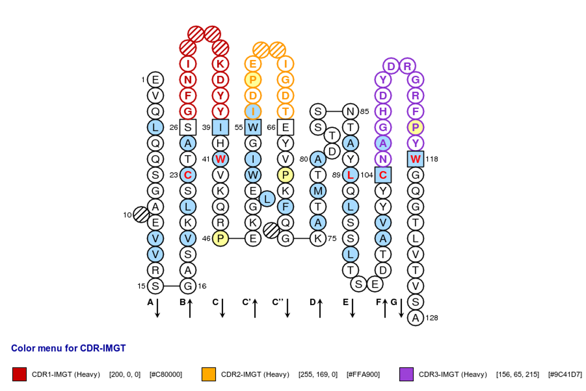
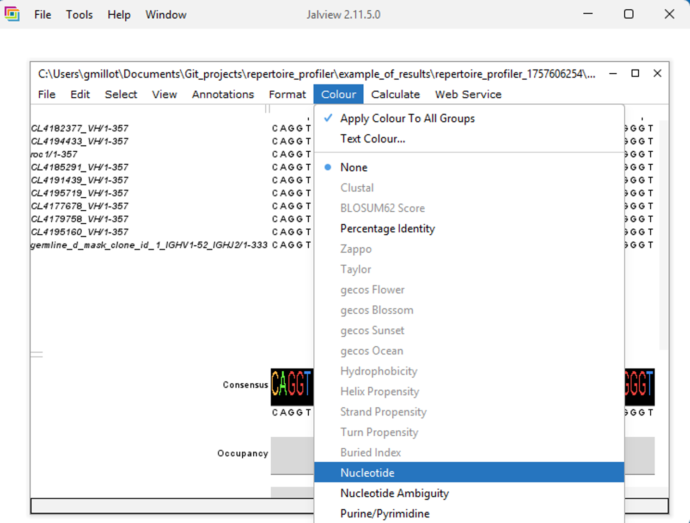
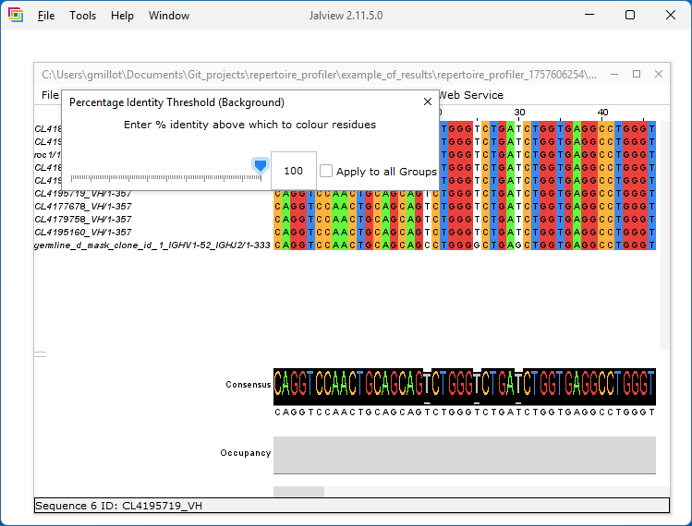

\n\n  \n\n

[comment]: <> (The following script is used to be able to zoom on images)

<head>
    <meta charset="UTF-8">
    <meta name="viewport" content="width=device-width, initial-scale=1.0">
    <title>Images cliquables</title>
    
</head>

[comment]: <> (End of script to zoom on images)

### Clicking on the html file

 

<ul>
<li>Warning: use the horizontal scrollbar of the window + the right click of the mouse on the alignment to see the left part of the representation.</li> 
<li>To change the aligments colors ("Nucleotide" recommanded for nucleotides):   

</li> 
<li>To annotate the FR and CDR regions, use the .gff file in the same folder than the opened .html file:   

</li> 
<li>Schematic illustration of these regions:   

</li> 
<li>Export as picture does not work well as part of the sequence not displayed are not exported (screenshot).</li>   
</ul>
</li>

   

### Jalview

 

In [Jalview](https://www.jalview.org/download/): 
<ul>
<li>import the .fasta file with the same name as the .html file (in the [fasta/for_alignment_aa](../fasta/for_alignment_aa) or [fasta/for_alignment_nuc](../fasta/for_alignment_nuc) folder):   

</li> 
<li>Add colors:   

</li> <li>Set a threshold to see the differences:   

</li> <li>A high threshold set all the columns with at least one difference in white:   

</li> <li>A low threshold set all the different minority events in each column in white:   

</li> <li>To export as .png for instance:   

</li>
</ul>

   

### Abalign

 

In [Abalign](http://47.108.188.197/abalign/), import a fasta file from the [fasta/for_alignment_aa](../fasta/for_alignment_aa) or [fasta/for_alignment_nuc](../fasta/for_alignment_nuc) folder and analyze interactively.  
Warning: if the <code>align_seq</code> parameter of the <i>nextflow.config</i> file is <code>query</code>, then the vizualization is performed only for the aa sequences that are in phase (i.e., that have identifiable v, d or j regions).

   

